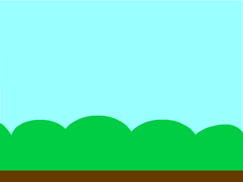
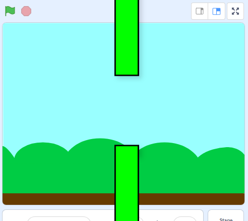
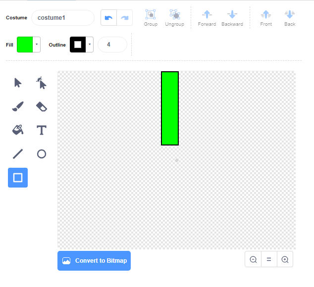
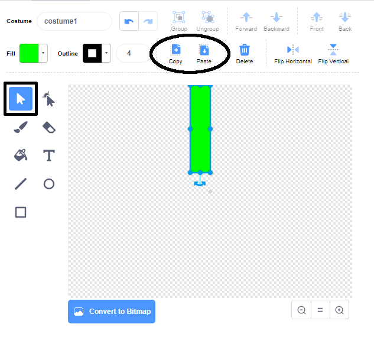
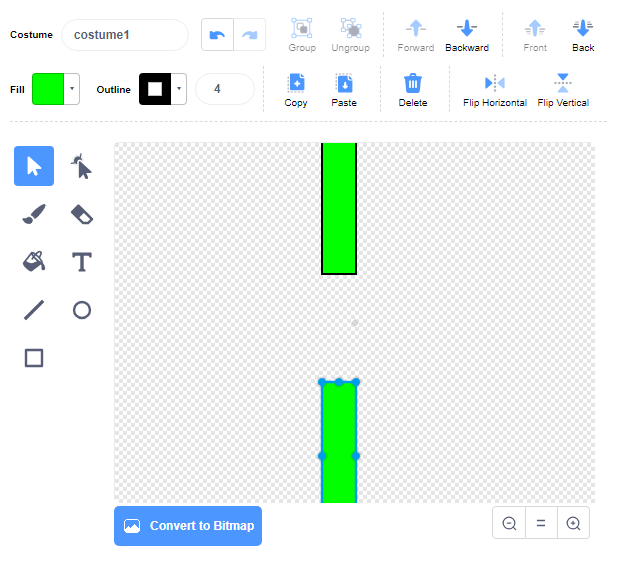

## Add the pipes

First, create the pipes.

--- task ---

Open a new empty Scratch project.

[[[generic-scratch3-new-project]]]

--- /task ---

--- task ---

Add a backdrop with an outdoor landscape. 'Blue Sky' is a good choice.



[[[generic-scratch3-backdrop-from-library]]]

--- /task ---

--- task ---

Create a new sprite and name it 'Pipes'.

[[[generic-scratch3-draw-sprite]]]

--- /task ---

The 'Pipes' sprite should be a pair of pipes with a gap in the middle. By moving the sprite up or down, you can put the gap in a different place.

This picture shows an example of how the pipes could be positioned. The parts of the sprite outside the Stage are normally hidden, you only see then when you drag the sprite:



You can't draw a sprite as big as the pipes need to be, but you can increase the size at which the sprite shows on the Stage.

--- task ---


Add code to make the sprite bigger.

```blocks3
when green flag clicked
set size to (200) %
```

This makes it's easier to see how big the pipes should be.

--- /task ---

--- task ---

Draw a rectangle for the top pipe as shown here:



--- /task ---

--- task ---

Fill the pipe with a colour you like.


--- /task ---

--- task ---

Create a duplicate of the pipe by selecting it and then clicking on **Copy** and **Paste**.



--- /task ---

--- task ---

Drag the copy of the pipe to the bottom of the screen so that the copy is in line with the other pipe. There needs to be a gap between the two pipes.



--- /task ---
