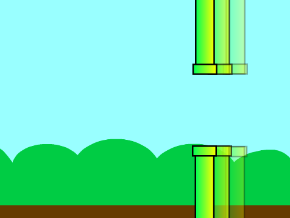

## Make the pipes move

Next you're going to make the pipes move across the screen to create an obstacle course.



--- task ---

First make the pipes appear by adding code to the Pipes sprite so that, `when the green flag is clicked`{:class="block3events"}, the sprite `forever`{:class="block3control"} `creates a clone of itself`{:class="block3control"} every two seconds. 


```blocks3
when green flag clicked
set size to (200) %
hide
forever 
  create clone of (myself v)
  wait (2) seconds
end
```

**Tip:** clones are just copies of a sprite, and they are really useful for creating games. 

--- /task ---

--- task ---

Next make the pipes move by adding code so that, `when a clone starts`{:class="block3control"}, the clone appears on the right side of the Stage and `glides`{:class="block3motion"} across to the left.


```blocks3
when I start as a clone
show
go to x: (240) y: (0)
glide (4) secs to x: (-240) y: (0)
delete this clone
```

**Tip:** you can stop the pipes scrolling by clicking the red **stop** button next to the green flag.

--- /task ---

Now you should have lots of pipes, but their gaps are always in the same place. 

You can add some variety by using a `random`{:class="block3operators"} number for the Pipes sprite's `y position`{:class="block3motion"}.


--- task ---

Modify your sprite's code so that each sprite clone `picks a random number from -80 to 80`{:class="block3operators"} and `glides`{:class="block3motion"} to that `y position`{:class="block3motion"}:


```blocks3
when I start as a clone
show
+ go to x: (240) y: (pick random (-80) to (80))
+ glide (4) secs to x: (-240) y: (y position)
delete this clone
```

--- /task ---

