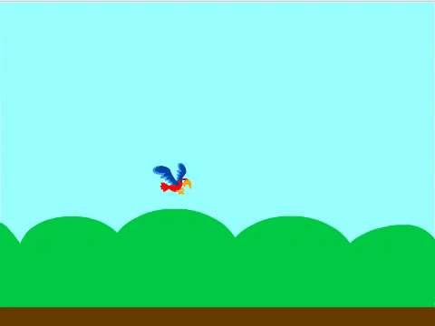
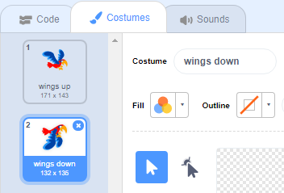

## Make Flappy fly

Now you will make Flappy flap upwards when you press the <kbd>space</kbd> bar. When you play the game, you have to time your taps to get Flappy through the gaps in the pipes.

--- no-print ---



--- /no-print ---

Make Flappy fly upwards when you tap the <kbd>space</kbd> bar.

--- task ---

When the `space key is pressed`{:class="block3events"}, Flappy should move upwards by `changing its y coordinate`{:class="block3motion"} by a small amount, for example `6`. 

Flappy flies upwards by `repeating`{:class="block3control"} this movement `10 times`{:class="block3control"}.

Add this code to your `Flappy` sprite:


```blocks3
when [space v] key pressed
repeat (10) 
  change y by (6)
end
```

--- /task ---

Now you need to get Flappy's wings flapping!

--- task ---

Click on the **Costumes** tab, and name Flappy's costumes 'wings up' and 'wings down'.



--- /task ---

--- task ---

Can you make Flappy's costume change to `wings down` when you press <kbd>space</kbd>, and then change it back to `wings up` halfway through the upward movement?

--- hints ---

--- hint ---

You need to split the upward motion in half so that you can use two `repeat`{:class="block3control"} blocks to change Flappy's costume at the beginning and in the middle of the movement.

Add `switch costume to`{:class="block3looks"} blocks to change how Flappy looks.

--- /hint ---
--- hint ---

You need to use these blocks:


```blocks3
repeat (5) 
  change y by (6)
end

repeat (5) 
  change y by (6)
end

switch costume to (wings up v)

switch costume to (wings down v)

when [space v] key pressed
```

--- /hint ---

--- hint ---

Your code should look like this:


```blocks3
when [space v] key pressed
switch costume to (wings down v)
repeat (5) 
  change y by (6)
end
switch costume to (wings up v)
repeat (5) 
  change y by (6)
end
```

--- /hint ---

--- /hints ---

--- /task ---

--- task ---

Test your code. As you see, at the moment nothing happens if you let Flappy hit a pipe.

--- /task ---

