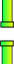

## Detect collisions

To make the game a challenge, the player needs to guide Flappy through the gaps without letting the parrot touch the pipes or the edges of the Stage. You need to add some blocks to detect when Flappy hits something. 

This is called __collision detection__.

--- task ---

Import a sound from the library that you want to play when Flappy collides with something. The 'screech' sound is a good choice.

[[[generic-scratch3-sound-from-library]]]

--- /task ---

A `wait until`{:class="block3control"} block is necessart to check whether Flappy is `touching the pipes`{:class="block3sensing"} `or`{:class="block3operators"} `touching the edge`{:class="block3sensing"}.

--- task ---

Add a new `when green flag clicked`{:class="block3control"} block to the 'Flappy' sprite, and also add the following code:


```blocks3
when green flag clicked
wait until <<touching (Pipes v) ?> or <touching (edge v) ?>>
play sound (screech v)
```

--- /task ---

--- task ---

Test your code. If Flappy touches a pipe, the 'screech' sound should play.

--- /task ---

Next, update the code so that the game stops when Flappy hits a pipe.

--- task ---

Add the following code to stop the game after a collision is detected:


```blocks3
when green flag clicked
wait until <<touching (Pipes v) ?> or <touching (edge v) ?>>
play sound (screech v)
+ say [Game Over!]
+ broadcast (Game Over v)
+ stop [other scripts in sprite v]
```

The `broadcast`{:class="block3events"} block tells other sprites that the game is over.

The `stop`{:class="block3control"} block stops other Flappy scripts that are running so that Flappy stops falling after a collision.

--- /task ---

--- task ---

Finally, add the following code to the `Pipes` sprite so that pipes `stop`{:class="block3control"} appearing `when the sprite receives Game Over`{:class="block3events"}.



```blocks3
when I receive [Game Over v]
stop [other scripts in sprite v]
```

--- /task ---

--- task ---

Test your game and see how long you can play before it's 'Game over'!

--- /task ---

