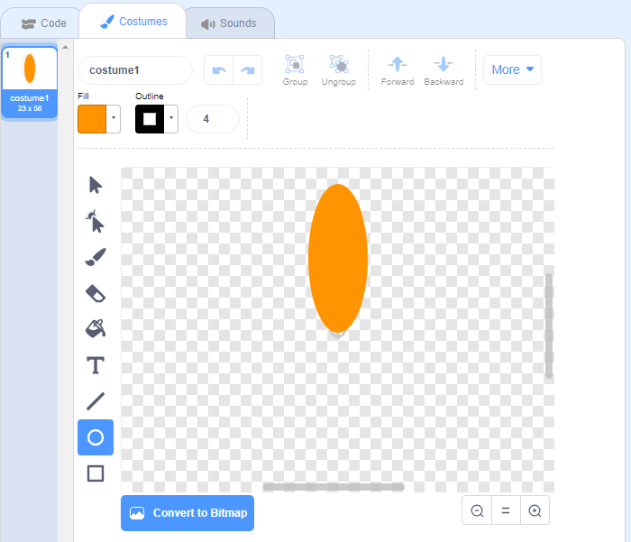

## Generate a flower

First you're going to generate a flower that can be drawn on the Stage. 

--- task ---

Create a new Scratch project, and delete the cat sprite.

[[[generic-scratch3-new-project]]]

--- /task ---

--- task ---

Add the Pen extension to your project.

[[[generic-scratch3-add-pen-extension]]]

--- /task ---

--- task ---

Now use the Paint tool to create a new sprite shaped like a flower petal.

Click on **Choose a sprite**, then click on **Paint** and rename the sprite 'Flower'.

[[[generic-scratch3-draw-sprite]]]

--- /task ---

--- task ---

Use the Circle tool to draw a petal shape filled in orange. 



Later, you will use code to add more colour.

--- /task ---

--- task ---

Add the following code to the Flower sprite to `stamp`{:class="block3extensions"} a flower with six equally rotated petals `when the green flag is clicked`{:class="block3control"}. 


```blocks3
when green flag clicked
repeat (6) 
  stamp
  turn cw (60) degrees
end
```

--- /task ---

You may find that your petals are arranged in an odd way:


This is because the sprite is being rotated around its centre. 

--- task ---

Move your petal so its bottom is in the centre.


Doing this may be easier if you zoom out.

--- /task ---

Before you run your code again, you should `erase all`{:class="block3extensions"} the sprites on the Stage to clear it.

--- task ---

Click on the `erase all` block in the Pen blocks section.

```blocks3
erase all
```

--- /task ---

--- task ---

Run your code again to check that the flower's petals are straight now.


If not, adjust the petal's position until its bottom in the centre.
 
--- /task ---
