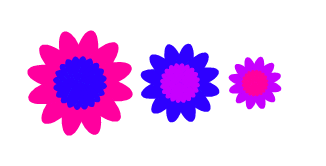

## Challenge: custom flower blocks

These flowers all have the same number of outer and inner petals, and the size of the inner flower is in proportion to the outer flower: 
 


You can create flowers like this with the help of a `draw double flower`{:class="block3myblocks"} custom block that has inputs for `outer colour`, `inner colour`, and `size`:

```blocks3
define draw double flower (outer colour) (inner colour) (size :: custom-arg)
draw flower (outer colour :: custom-arg) (size :: custom-arg) (12) :: custom
draw flower (inner colour :: custom-arg) ((size :: custom-arg) / (2)) (20) :: custom
```

The `draw double flower`{:class="block3myblocks"} block can draw lots of flowers in the same style:

```blocks3
when [d v] key pressed
erase all
go to x: (-100) y: (0)
draw double flower (160) (120) (100) :: custom
change x by (100)
draw double flower (120) (140) (75) :: custom
change x by (75)
draw double flower (140) (160) (50) :: custom
```

Make a new custom block with the necessary inputs that you need to be able to change to create a type of flower that you like.

Then use your new block to create a cool design! 
