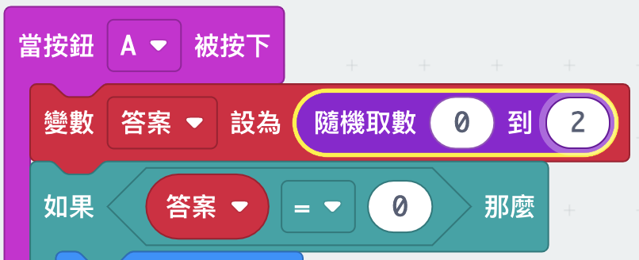

--- challenge ---

## Challenge: Multiple answers
Can you add code so that 'Yes' is displayed on your micro:bit __if__ the answer is 1? You can even change the text shown to something more interesting than just 'Yes' and 'No'!

You can even make your micro:bit say something like 'Maybe' or 'Ask again' if the answer is 2. To get this working, you'll also need to change your code to choose a random number between 0 and 2!

Tip: You can right-click on an `if` block to duplicate the block and its contents.

--- /challenge ---
