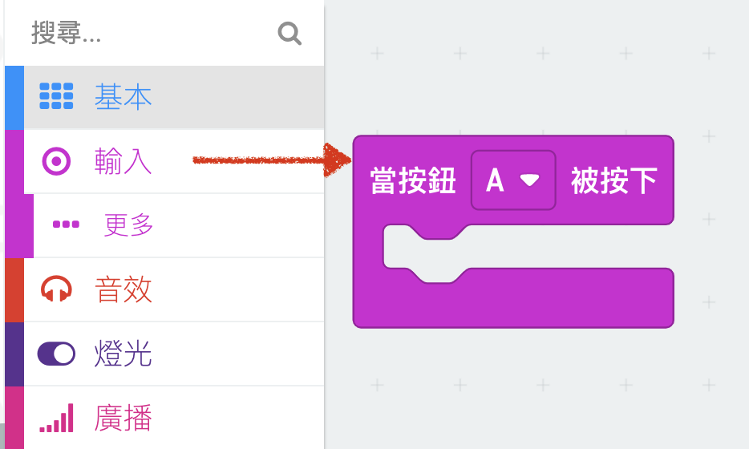
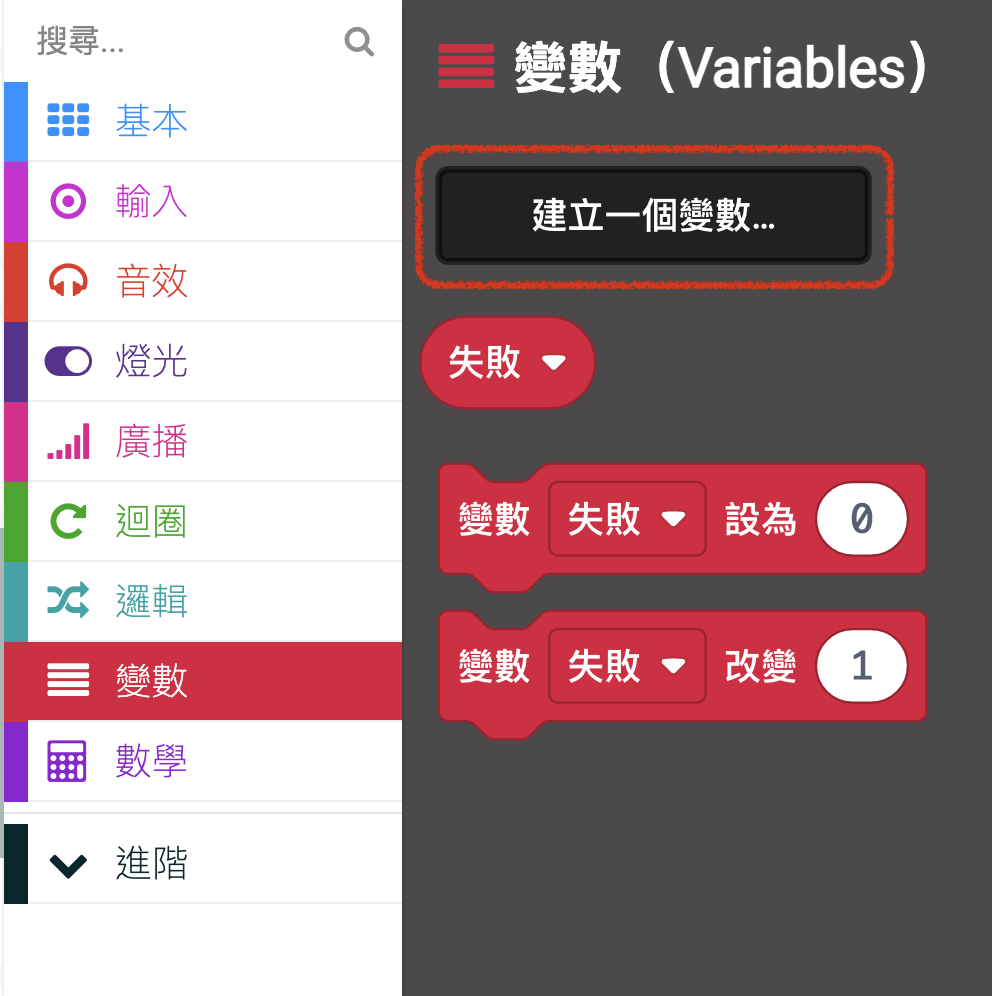
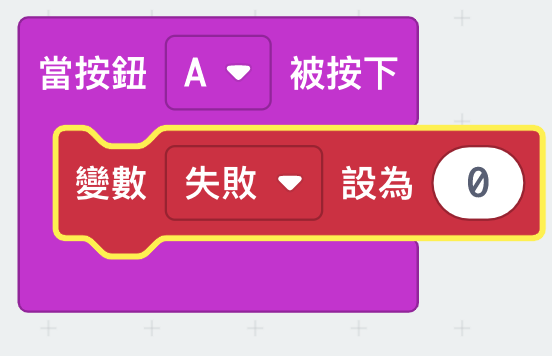
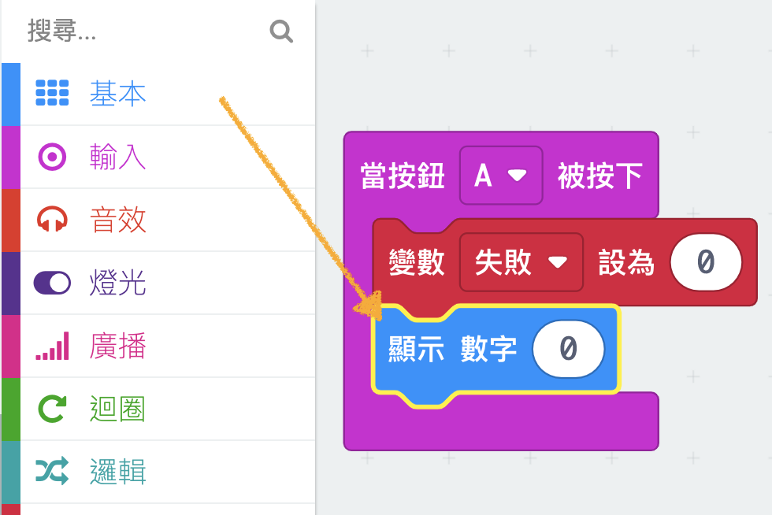
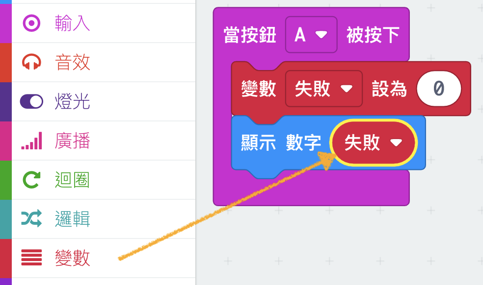

## Storing fails

Let's start by creating a place to store the number of fails.

+ Go to <a href="https://rpf.io/microbit-new" target="_blank">rpf.io/microbit-new</a> to start a new project in the MakeCode (PXT) editor. Call your new project 'Frustration'.

+ Delete the `forever` and `start` blocks by dragging them to the palette:

+ A new game should start when the player presses button A. Click 'Input' and then `on button A pressed`.

+ Now you need a variable to store the number of times you fail in the game by touching the wire with the wand. Click on 'Variables' and then 'Make a new Variable'. Name the variable `fails`.

+ Drag a `set` block from 'Variables' and select `fails`:

This will set the number of fails to zero when you press the A button. 

+ Finally, you can display the number of `fails` on your micro:bit. To do this, first drag a `show number` block from 'Basic' to the end of your script.

+ Then drag `fails` from 'Variables' into your `set block`.

	
+ Click 'run' to test your script. Clicking button A should display the number of fails, which has been set to `0`.

