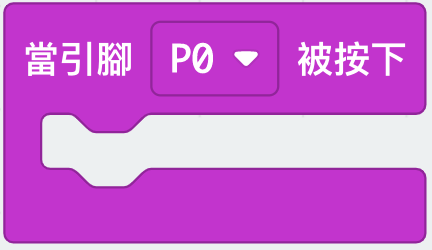
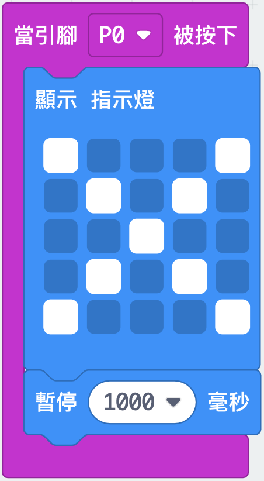
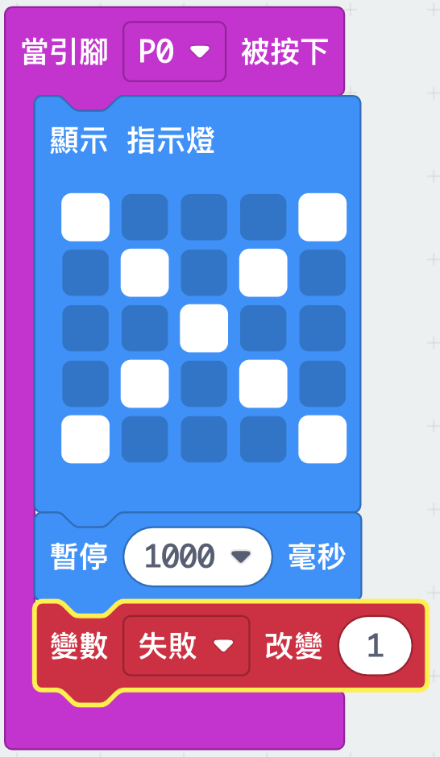
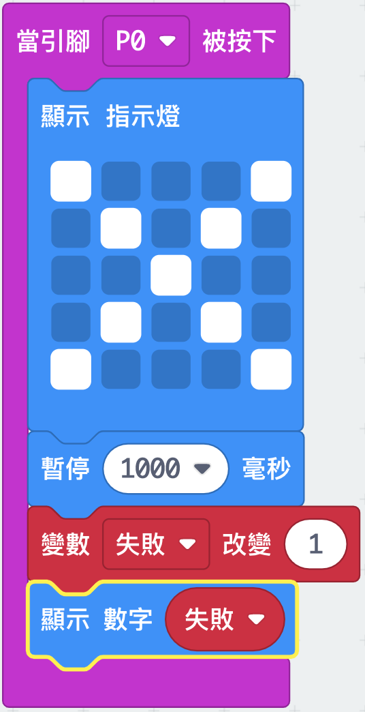

## Keeping track of fails

Let's add code to keep track of fails.

+ You're going to add 1 to your `fails` variable every time a connection is made on Pin0. To do this, drag `on pin P0 pressed` from 'Input'.

+ Next, add 2 blocks to display a cross for 1 second when Pin0 is pressed.

+ You'll then need to add 1 to your `fails` variable. To do this, click the drag a `change item by 1` from Variables and change `item` to `fail`. 

+ Finally, you can add code to display the updated number of fails. Here's how your code should look.

+ Test your code by pressing button A on the emulator to start your game. Each time you press Pin0 you should see your `fails` variable increase by 1.

+ Click 'Download' and transfer your script onto your micro:bit. You can press Pin0 by completing a circuit. To do this, place your right thumb on the ground pin (GND) and then tap Pin0 with your left thumb.

