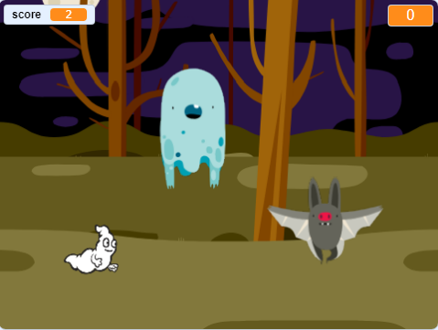

## Challenge: more sprites

Can you add other sprites to your game?

You need to think about some things for each sprites you want to add:

+ How big should the sprite be?
+ Should it appear more or less often than the ghost sprite?
+ What does it look/sound like when it gets caught?
+ How many points does the player win (or lose) for catching the sprite?

If you need help, you can back through to the instructions in the previous steps, or ask a friend!
