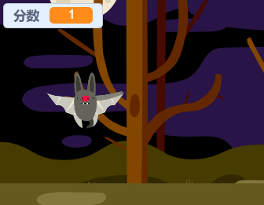

## 添加计分功能

现在你将通过计分功能来使你的游戏更加有趣！

--- task ---

创建一个新的名为`分数`{:class="block3variables"}的变量

[[[generic-scratch3-add-variable]]]

--- /task ---

--- task ---

你能记录玩家的得分吧？当玩家点击幽灵并抓住它们时，应该获得一定的分数。

玩家每次点到幽灵时，他们的分数应当增加。



--- hints ---
 --- hint ---

`当点击绿旗时`{:class="block3events"}，你的分数变量`分数`{:class="block3variables"}变量应当被`置为0`{:class="block3variables"}。 舞台是添加此代码的最佳位置。

`当幽灵角色被点击到时`{:class="block3events"}，分数变量`分数`{:class="block3variables"}的值应当`增加1`{:class="block3variables"}。

--- /hint --- --- hint --- 以下是您需要的代码块：

```blocks3
将[分数 v]设为(0)

当 ⚑ 被点击
```


```blocks3
将 [分数 v] 增加 (1)
```

--- /hint --- --- hint --- 

```blocks3
当 ⚑ 被点击
将 [分数 v] 设为 (0)
```


```blocks3
当角色被点击
隐藏
+ 将[分数 v]增加(1)
```

--- /hint ------ /hints ---

--- /task ---