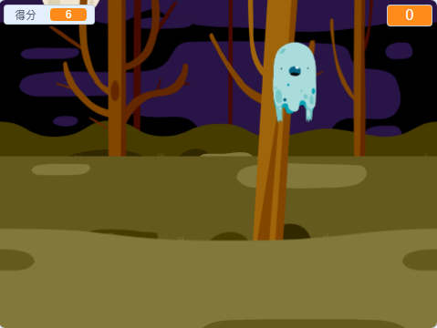

--- no-print ---

這個專案是 **Scratch 3** 版本。另外還有 [Scratch 2](https://projects.raspberrypi.org/en/projects/ghostbusters-scratch2) 版本。

--- /no-print ---

## 介紹

你將製作一個人捉鬼的遊戲！

--- no-print ---

  <iframe allowtransparency="true" width="485" height="402" src="https://scratch.mit.edu/projects/embed/370010908/?autostart=false" frameborder="0" scrolling="no"></iframe>
  

--- /no-print ---

--- print-only ---

--- /print-only ---

--- collapse ---
---
title: 你會用到
---
### 硬體

- 一台電腦

### 軟體

- Scratch 3（[線上版](http://rpf.io/scratchon){:target="_blank"} 或 [離線版](http://rpf.io/scratchoff){:target="_blank"}）

--- /collapse ---

--- collapse ---
---
title: 你會學到
---
- 了解迴圈（loop）內兩個動作之間必須暫停一下
- 用 Scratch 程式產生隨機（random）的數字
- 用 Scratch 程式添加一個變數（variable）來儲存遊戲得分

--- /collapse ---

--- collapse ---
---
title: 給教師的其它資訊
---
--- no-print ---

如果你需要列印這個專案，可以先切換成[列印友好模式](https://projects.raspberrypi.org/zh-TW/projects/ghostbusters/print){:target="_blank"}。

--- /no-print ---

你可以在這裡找到[已經完成的專案](http://rpf.io/p/zh-TW/ghostbusters-get){:target="_blank"}。

--- /collapse ---