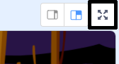

## 抓鬼的程式

現在你要寫個讓玩家能抓鬼的的程式！

--- task ---

你能在鬼被抓到時，讓鬼消失嗎？（玩家用滑鼠點到鬼就算抓到了）。

如果你在測試遊戲時，發現很難捉到鬼，可以試著用把畫面變大一點再進行遊戲：



--- hints --- --- hint ---

當幽靈`被點擊到`{:class="block3events"}，你的幽靈角色應該`消失`{:class="block3looks"}。

--- /hint --- --- hint ---

你的程式應該會像這樣：


```blocks3
當角色被點擊
隱藏
```

--- /hint --- --- /hints ---

--- /task ---