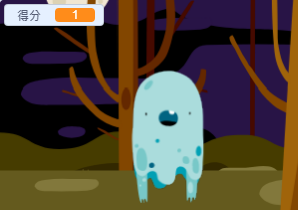

## 記錄得分

現在，我們來記錄分數，讓遊戲變得更加有趣！

--- task ---

建立一個新的變數，名稱叫`得分`{:class="block3variables"}。

[[[generic-scratch3-add-variable]]]

--- /task ---

--- task ---

你可以記錄玩家的分數嗎？玩家抓到鬼時應該可以得分。

玩家每次點擊幽靈時，得分都應該要增加。



--- hints --- --- hint ---

`在點擊綠旗後`{:class="block3events"}，遊戲的`得分`{:class="block3variables"}變數應該被`設定成 0`{:class="block3variables"}。 舞台是最適合寫這個程式的地方。

`只要一抓到鬼`{:class="block3events"}，玩家的`得分`{:class="block3variables"}變數就會`改變 1`{:class="block3variables"}。

--- /hint --- --- hint ---

這裡是你需要的程式積木：


```blocks3
變數 [得分 v] 設為 (0)

當 @greenflag 被點擊
```


```blocks3
變數 [得分 v] 改變 (1)
```

--- /hint --- --- hint ---


```blocks3
當 @greenflag 被點擊
變數 [得分 v] 設為 (0)
```


```blocks3
當角色被點擊
隱藏
+ 變數 [得分 v] 改變 (1)
```

--- /hint --- --- /hints ---

--- /task ---