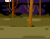

## 計時開始

現在我們來添加一個計時器，在限時 10 秒內看玩家能抓到多少鬼。

--- task ---

建立一個名為「時間」的變數。

--- /task ---

--- task ---

你可以在舞台裡添加一個計時工具，限定玩家只有 10 秒時間捉鬼嗎？

你的計時器應該要：

+ 從 10 秒開始計算
+ 每秒倒數

遊戲應該在計時器算到 0 的時候就停止。

--- hints --- --- hint ---

`在點擊綠旗後`{:class="block3events"}，遊戲的`時間`{:class="block3variables"}變數應該被`設定成 10`{:class="block3variables"}。 然後它應該每等 1 秒就`改變 -1`{:class="block3variables"}，`直到它到 0 為止`{:class="block3control"}。

--- /hint --- --- hint ---

這裡是你需要的程式積木：



```blocks3
停止 [全部 v]

< [ ] = [ ] >

變數 [時間 v] 設為 (10)

變數 [時間 v] 改變 (-1)

(時間)

等待 (1) 秒

重複直到 < >
end

當 @greenflag 被點擊

```

--- /hint --- --- hint ---

這裡是你創建計時器的程式：


```blocks3
當 @greenflag 被點擊
變數 [時間 v] 設為 (10)
重複直到 < (時間) = [0] >
等待 (1) 秒
變數 [時間 v] 改變 (-1)
end
停止 [全部 v]
```

--- /hint --- --- /hints ---

--- /task ---

--- task ---

讓朋友測試你的遊戲。 他們最高可以得多少分？

--- /task ---

如果你覺得遊戲太簡單了，你可以：

+ 給玩家更少的時間
+ 讓鬼出現的頻率降低
+ 把鬼變小一點

--- task ---

修改並測試你的遊戲，改到你對遊戲的難度滿意為止。

--- /task ---