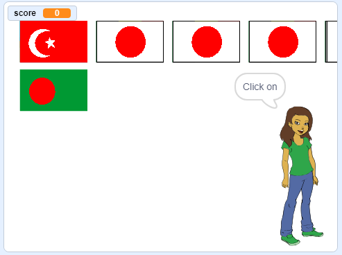

## Start a new round

At the moment there is only one round in the quiz, so the quiz doesn't last long. You are going to set up multiple rounds.

--- task ---

Create a new `broadcast`{:class="block3events"} that sends the message 'Start the round'.


```blocks3
broadcast (start the round v)
```

--- /task ---

--- task ---

Add a `when I receive 'Start the round'`{:class="block3events"} block, and then move all of the code from below the `when green flag clicked`{:class="block3events"} block to below this new block.


```blocks3
+ when I receive [start the round v]
set [score v] to [0]
create flag list :: custom
delete (all v) of [chosen flags v]
repeat (6)
    choose random flag :: custom
end
set [correct answer v] to (item (pick random (1) to (length of [chosen flags v])) of [chosen flags v])
clone flags :: custom
+ broadcast (announce country v)
```

--- /task ---

--- task ---

Remove the `set score to 0`{:class="block3variables"} block and place it back below the `when green flag clicked`{:class="block3control"} block. Then add the new `broadcast`{:class="block3events"} block below both of them.


```blocks3
when green flag clicked
set [score v] to [0]
broadcast (start the round v)
```

--- /task ---

--- task ---

After the code that checks whether the answer is correct, add another `broadcast`{:class="block3events"} block so that a new round can start once a question is answered.


```blocks3
when this sprite clicked
if <(costume [name v]) = (correct answer :: variables)> then
    change [score v] by [1]
    say [Correct] for (2) seconds
else
    say [Sorry, that was wrong] for (2) seconds
end
+ broadcast (start the round v)
```

--- /task ---

--- task ---

Click the green flag to test your code. Click on one of the flags to play a round. Do you notice that the next round does not get set up properly?



--- /task ---

This is because before the game starts another round, the game needs to first clear up the cloned flags.

--- task ---

Create another new `broadcast`{:class="block3events"} called 'clean up'.


```blocks3
broadcast (clean up v)
```

--- /task ---

--- task ---

Set the Flag sprite to `delete this clone`{:class="block3control"} when it receives the `clean up`{:class="block3events"} broadcast.


```blocks3
when I receive [clean up v]
delete this clone
```

--- /task ---

--- task ---

Place the `clean up`{:class="block3events"} broadcast block just above where the game starts a new round after an answer has been given.

```blocks3
when this sprite clicked
create flags list  :: custom
if <(item (costume [number v]) of [flags v]) = (correct answer :: variables)> then
    say [Correct] for (2) seconds
    change [score v] by [1]
else
    say [Sorry, that was wrong] for (2) seconds
end
+ broadcast (clean up v)
broadcast (start the round v)
```

--- /task ---

--- task ---

Test your code again and check that you can play multiple rounds, and that your score increases as you get answers correct.

--- /task ---

--- task ---

Make sure you hide the `correct answer`{:class="block3variables"} variable so the player can't see it!

--- /task ---
