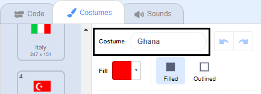
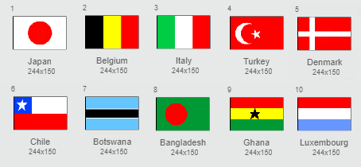

## Draw the flags

--- task ---

Open the 'Guess the flag' Scratch starter project.

**Online:** open the starter project at [rpf.io/guess-the-flag-on](http://rpf.io/guess-the-flag-on){:target="_blank"}. If you have a Scratch account, you can click on **Remix** in the top right-hand corner of the online editor to save a copy of the project.

**Offline:** open the [starter project](http://rpf.io/p/en/guess-the-flag-go) in the offline editor.

If you need to download and install the Scratch offline editor, you can find it at [rpf.io/scratchoff](http://rpf.io/scratchoff){:target="_blank"}.

--- /task ---

Select the Costumes tab. You should see eight flags there.

Scroll to the bottom of the list of costumes, where there are two blank costumes. These costumes are there so you can add your own flags.

--- task ---

Click on the 'Your flag 1' costume, and change its name to  the name of a country.

--- /task ---

--- task ---

Draw that country's flag. Make sure your drawing is exactly the same size as the flag costume.

If you are stuck for ideas, you can find some flags on [this 'Flags of the world' web page](https://www.countries-ofthe-world.com/flags-of-the-world.html){:target="_blank"}.

--- /task ---

--- task ---

Repeat this process for the second blank flag costume so that there are ten flag costumes in total.

--- /task ---

Here are the flags that act as examples in the 'Guess the flag' project, but you can choose any flags you like for your game.

