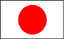
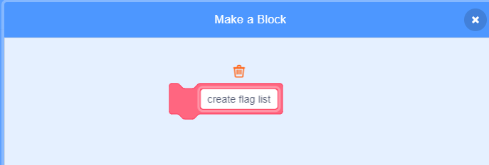

## Create a list of flags

--- task ---

Click on the Code tab. There is a list called `flags`{:class="block3variables"}, where you store the names of the countries that your game has flag costumes for.

--- /task ---

--- task ---

Add two more code blocks, one each for the other two flags you created, so there is a total of ten blocks that add all ten countries to the `flags`{:class="block3variables"} list.



```blocks3
add [Country] to [flags v]
```

--- /task ---

--- task ---

Click the green flag and check that the countries appear in the list.

--- /task ---

If you press the green flag more than once, the countries get added to the list again, and the result is a list of 20 countries instead of 10.

--- task ---

At the start of the code, add a block to `delete all`{:class="block3variables"} of the countries in the list before adding them. This will stop the countries from being added to the list more than once.


```blocks3
when green flag clicked
+ delete (all v) of [flags v]
add [Japan] to [flags v]
add [Belgium] to [flags v]
add [Italy] to [flags v]
add [Turkey] to [flags v]
add [Denmark] to [flags v]
add [Chile] to [flags v]
add [Botswana] to [flags v]
add [Bangladesh] to [flags v]
add [Ghana] to [flags v]
add [Luxembourg] to [flags v]
```

--- /task ---

Next, make a custom block. A custom block is a special block with a name. The custom block you'll make will let you create a list of flags using only this one block instead of lots of blocks.

--- task ---

Click on **My Blocks** and then on **Make a Block**. Call your custom block `create flag list`{:class="block3myblocks"}.




--- /task ---

--- task ---

Drag all the code away from below the `when flag clicked`{:class="block3events"} block to below the new `create flag list`{:class="block3myblocks"} block.

```blocks3
define create flag list
delete (all v) of [flags v]
add [Japan] to [flags v]
add [Belgium] to [flags v]
add [Italy] to [flags v]
add [Turkey] to [flags v]
add [Denmark] to [flags v]
add [Chile] to [flags v]
add [Botswana] to [flags v]
add [Bangladesh] to [flags v]
add [Ghana] to [flags v]
add [Luxembourg] to [flags v]
```

--- /task ---

--- task ---

Below the `when flag clicked`{:class="block3events"} block, add the new `create flag list`{:class="block3myblocks"} block.


```blocks3
when green flag clicked
create flag list :: custom
```

--- /task ---  
