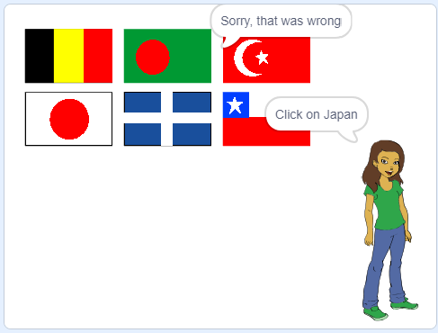

## Check the answer

Your sprite now asks the player to click on the correct flag. Then the game needs to check whether the flag that was clicked is the right answer.

--- task ---

Go back to the Flag sprite code, and add a block to start a new section of code that will run `when this sprite is clicked`{:class="block3events"}.


--- /task ---

Then your quiz needs to check whether the costume name of the Flag sprite that was clicked is the same as the correct answer.

--- task ---

Add code to say 'Correct' if the costume name of the Flag sprite is the same as the `correct answer`{:class="block3variables"} variable, or to say 'Sorry, that was wrong' if the name and the variable are not the same.

You can use this useful block here as well.

```blocks3
(item (10 v) of [flags v])
```

This time, combine it with a `costume name`{:class="block3looks"} block to get the name of the current Flag sprite costume.


--- hints ---
--- hint ---

`When this sprite is clicked`{:class="block3events"},  `if`{:class="block3control"} this `costume name`{:class="block3looks"} equals the `correct answer`{:class="block3variables"}, `say`{:class="block3looks"} 'Correct', or `else`{:class="block3control"} `say`{:class="block3looks"} 'Sorry, that was wrong'.

--- /hint ---

--- hint ---

Here are the code blocks you need:

```blocks3
say [Sorry, that was wrong] for (2) seconds

say [Correct] for (2) seconds

if <> then
else
end

(costume [name v])

<[] = []>

(correct answer)

when this sprite clicked
```

--- /hint ---

--- hint ---

This is what your code should look like:

```blocks3
when this sprite clicked
if <(costume [name v]) = (correct answer :: variables)> then
    say [Correct] for (2) seconds
else
    say [Sorry, that was wrong] for (2) seconds
end
```

--- /hint ---

--- /hints ---
--- /task ---

--- task ---

Press the green flag and test your code twice: once by picking the correct flag, and once by picking an incorrect one. Check that the right message appears depending on whether you give the right or wrong answer.



--- /task ---
