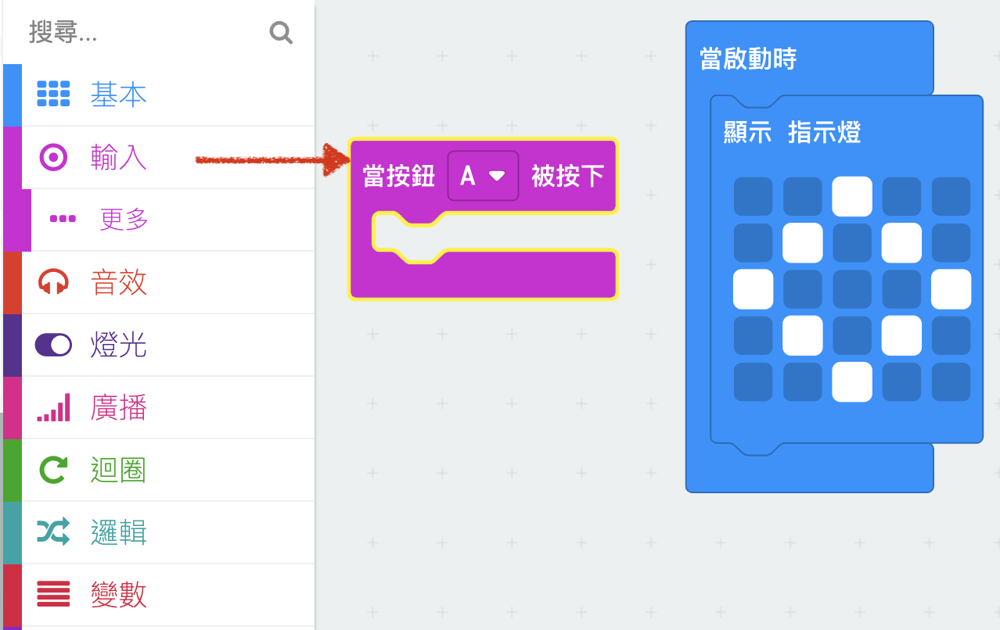
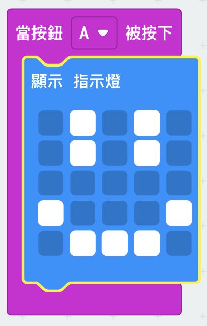

## Displaying a happy face

Let's show a happy face on your micro:bit when the 'A' button is pressed.

+ So far, you've only run code when the micro:bit is powered on. You can also run code when a button is pressed.

Drag an 'on button pressed' block from input and make sure 'A' is selected:

Any code added inside this block will run when the 'A' button on your micro:bit is pressed.

+ Drag another `show leds` block inside your new event, and draw a happy face pattern.

+ Test out your new code in the emulator. Press the 'A' button and you should see a happy face on your micro:bit:

You can also test out your new code on your micro:bit.

