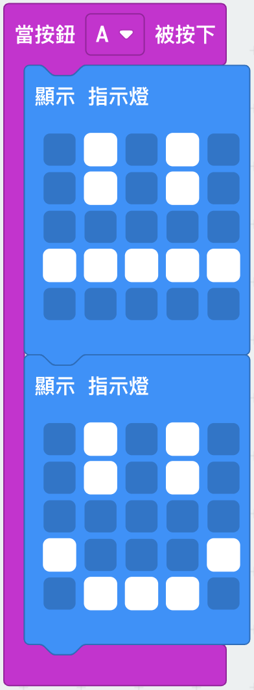
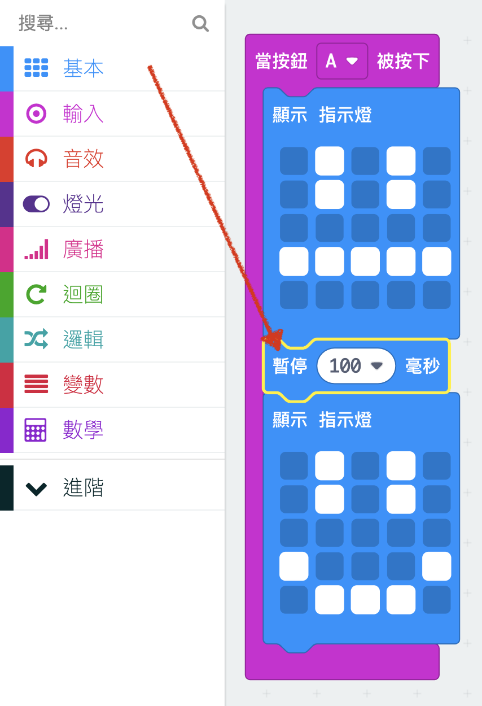
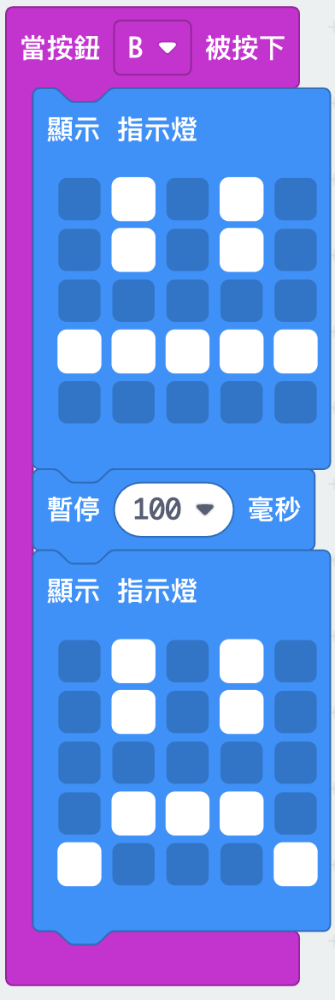

## Creating a simple animation

Let's create a (very) simple animation for your happy and sad faces.

+ Add a second `show leds` block to your `on button A pressed` block, with a neutral face.

+ If you run this code to test it, you'll notice that the pattern changes quickly. For a longer delay, you'll need to add a `pause` block between the two images being displayed.

To choose how many milliseconds to wait, click the down-arrow and enter a number. 1000 milliseconds is 1 second, so 250 milliseconds is a quarter of a second.

+ You'll also need to animate your sad face. The easiest way to do this is to duplicate the blocks you've just created. Right-click on a block to duplicate it. Note that the PXT editor just duplicates one block at a time (not multiple blocks like Scratch.)

+ You can then drag these blocks into your `on button B pressed` block. This is how your code should look:

+ Test your code, and you should see your animated happy and sad faces when you press button A and B.

