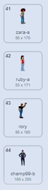

## Add costumes

---task ---

Open a new Scratch project.

**Online**: open a new online Scratch project at [rpf.io/scratch-new](http://rpf.io/scratch-new){:target="_blank"}.

**Offline**: open a new project in the offline editor.

If you need to download and install the Scratch offline editor, you can find it at [rpf.io/scratchoff](http://rpf.io/scratchoff){:target="_blank"}.

--- /task ---
--- task ---

Add some more costumes to the cat sprite. You need to add at least forty different costumes for your sprite.

It's best to select costumes from the **People** section, but if you want to, you can choose costumes from other sections as well.

[[[generic-scratch3-add-costume]]]

Once you have your costumes, you can delete the default cat costumes if you want to.

--- /task ---
