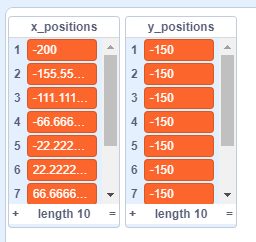

## Test the script

--- task ---

To test the script, you need to **call** the custom block and provide it with the number of `columns`{:class="block3myblocks"} you want in your grid.

Add this code to your sprite:

```blocks3
when flag clicked
generate positions (1) (10) ::custom
```

--- /task ---

--- task ---

Now click on the green flag to run your code. You should see your two lists fill with values.


	
If your results don't look like this, then go back to the previous step, have a look at the hints, and try to fix your script.

--- /task ---
