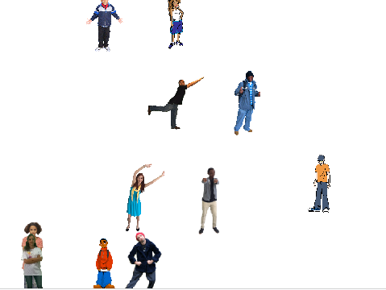

## Add rows

Now that you have the code to create a single row of stamped costumes, you should add code to create more rows.

Go to your `generate positions`{:class="block3myblocks"} block.

```blocks3
define generate positions (rows)(columns)
delete [all v] of [y_positions v]
delete [all v] of [x_positions v]
set [y_pos v] to [-150]
set [x_pos v] to [-200]
repeat (columns :: custom-arg)
add (x_pos) to [x_positions v]
add (y_pos) to [y_positions v]
change [x_pos v] by (((400) / (columns)) - (1))
```

--- task ---

Add another `repeat`{:class="block3control"} loop that runs the number of times you give to the `generate positions`{:class="block3myblocks"} block as the `rows`{:class="block3myblocks"} input. Place the `repeat`{:class="block3control"} loop into your script as shown here:

```blocks3
define generate positions (rows)(columns)
delete [all v] of [y_positions v]
delete [all v] of [x_positions v]
set [y_pos v] to [-150]
+repeat (row :: custom-arg)
set [x_pos v] to [-200]
repeat (columns :: custom-arg)
add (x_pos) to [x_positions v]
add (y_pos) to [y_positions v]
change [x_pos v] by (((400) / (columns :: custom-arg)) - (1))
end
end
```

--- /task ---

Next you need to increase the value of `y_pos`{:class="block3variables"} each time the `repeat (rows)`{:class="block3control"} loop runs.

You do this in a similar manner to how you increase the value of `x_pos`{:class="block3variables"} in the `repeat (columns)`{:class="block3control"} loop.

--- task ---

At the end of the code inside the `repeat (rows)`{:class="block3control"} loop, `y_pos`{:class="block3variables"} should increase up to `150`{:class="block3variables"}, which is `300`{:class="block3variables"} away from its starting value of `-150`{:class="block3variables"}. This needs to happen for each row of stamps.

```blocks3
define generate positions (rows)(columns)
delete [all v] of [y_positions v]
delete [all v] of [x_positions v]
set [y_pos v] to [-150]
repeat (rows :: custom-arg)
set [x_pos v] to [-200]
repeat (columns :: custom-arg)
add (x_pos) to [x_positions v]
add (y_pos) to [y_positions v]
change [x_pos v] by (((400) / (columns :: custom-arg)) - (1))
end
+change [y_pos v] by (((300) / (rows :: custom-arg)) - (1))
end
```

--- /task ---

--- task ---

Make sure you give the number of `rows`{:class="block3myblocks"} as an input to your blocks.

```blocks3
when flag clicked
erase all
generate positions (4) (10) ::custom
stamp sprite (4) (10) ::custom
```

--- /task ---
	
--- task ---

Run your code now.


	
You won't get a neat grid of stamps.

This is because, right now, the `stamp sprite`{:class="block3myblocks"} block only runs for the total number of columns.

--- /task ---

--- task ---

Change your `stamp sprites`{:class="block3myblocks"} script so that it `repeats`{:class="block3control"} enough times to stamp the complete grid of sprites.

--- hints --- 
--- hint ---

The total number of stamps you need is the number you give as `columns`{:class="block3myblocks"} multiplied by the number you give as `rows`{:class="block3myblocks"}

--- /hint --- 
--- hint ---

Use this additional block:

```blocks3
((rows ::custom) * (columns ::custom))
```

--- /hint --- 
--- hint ---

Here's the completed `stamp sprites`{:class="block3myblocks"} script:

```blocks3
define stamp sprites (rows) (columns)
set size to (40) %
+ repeat ((rows :: custom-arg) * (columns :: custom-arg))
set [index v] to (pick random (1) to (length of [x_positions v]))
go to x: (item (index) of [x_positions v]) y: (item (index) of [y_positions v]
delete (index) of [x_positions v]
delete (index) of [y_positions v]
stamp
next costume
```

--- /hint --- 
--- /hints ---


--- /task ---
