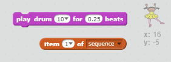
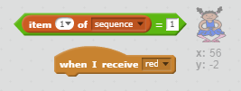

## 重复序列

让我们添加四个按钮，玩家通过按下这些按钮来重复他们记住的序列。

+ 向你的项目添加四个新子图来代表四个按钮。编辑造型让四种颜色中的每种都对应一个子图。将子图按照与造型颜色一致的顺序排列 — 红色、蓝色、绿色、黄色。


+ 点击红色鼓时，你将需要向你的角色广播一条信息，使他们知道红色按钮已被点击。向你的红色鼓添加此代码：

```blocks
	当角色被点击
  广播消息 [red v]
```

广播有点像通过扬声器发出一条公告 — 你可能会在超市购物时听到这种公告。所有子图都可听到此消息，但只有担任响应职责的子图才会采取行动。

+ 向蓝色、绿色和黄色鼓添加类似代码，使其广播有关自身颜色的消息。

--- hints ---
--- hint ---
以下为从一个子图向另一个复制代码的一种简单方式。更改每个子图中的广播信息以匹配子图的颜色。

--- /hint ---
--- /hints ---

还记得我们说过广播有点像通过扬声器发出一条公告吗？只有担任响应职责的子图才会采取行动，因此我们来让角色子图担任起对信息做出响应的职责。我们通过为角色编写某些代码使其在听到每条信息时有所行动来做到这一点。

 + 你的角色子图收到 `红色` 信息时，代码应检查数字 `1` 是否位于列表的开始位置（这意味着 `红色` 是序列中的下一个颜色）。

 如果是，代码应将该数字从列表中移除，因为对颜色的猜测正确。否则游戏结束，我们则需要 `停止全部`{:class="blockcontrol"}来停止游戏。

```blocks
	当收到消息 [red v]
  如果 <(item (1 v) of [sequence v] :: list) = [1]> 那么 
   删除第 (1 v) 项 \( [sequence v] \)

   说出 [Game over!] (1) 秒
   停止 [全部 v]
  end
```

+ 添加到你刚刚编写的代码中，使得收到正确颜色时也能播放鼓声。

--- hints ---
--- hint ---
你能否使用与每种颜色相对应的数字来播放正确的鼓声？
+ 1 = 红色
+ 2 = 蓝色
+ 3 = 绿色
+ 4 = 黄色
--- /hint ---
--- hint ---
你将需要添加 `弹奏鼓声`{:class="blocksound"}代码块，以在 `删除序列的第 1 项`{:class="blockdata"}之前播放顺序列表中的第一个声音：


--- /hint ---
--- hint ---
以下是你将需要添加的代码：

```blocks
 演奏节拍 (链表第 (1 v) 项项目\( [sequence v] \) :: list) (0.25) 拍
```
--- /hint ---
--- /hints ---

+ 复制你用来使你的角色子图对信息 `红色` 做出回应的代码。这次，将信息变更为 `蓝色`。

子图对信息 `蓝色` 做出回应时，哪段代码应保持原样，哪段应做出变动？请记住每种颜色都有一个对应的数字。

+ 更改你的代码，使角色对 `蓝色` 信息做出正确回应。

--- hints ---
--- hint ---
保留这些代码块，但你将需要在一定程度上进行更改：

--- /hint ---
--- hint ---
你的蓝色广播代码应如下所示。

```blocks
	当收到消息 [blue v]
  如果 <(item (1 v) of [sequence v] :: list) = [2]> 那么 
   演奏节拍 (链表第 (1 v) 项项目\( [sequence v] \) :: list) (0.25) 拍
   删除第 (1 v) 项 \( [sequence v] \)

   说出 [Game over!] (1) 秒
   停止 [全部 v]
end
```

--- /hint ---
--- /hints ---

+ 再次为绿色和黄色按钮复制两次该代码，并更改必要的部分，使得角色能做出正确回应。

+ 请记得测试你所添加的代码！你能记住五种颜色的序列吗？序列是否每次都不一样？

列表清空后，你还可以展示一些闪光灯作为奖励，因为这意味着正确记住了整个序列。

+ 向你角色的 `当绿色旗帜被点击`{:class="blockevents"}脚本的末端添加此代码：

```blocks
	等待直到 <(length of [sequence v] :: list) = [0]>
  广播消息 [won v] 并等待
```

+ 切换到工作区，然后添加此代码来播放声音并使背景在玩家胜利时改变颜色。你可以选择任何你喜欢的声音。

```blocks
	当收到消息 [won v]
  播放音效 [drum machine v]
  重复 (50) 次 
   效果 [颜色 v] 改变 (25)
   等待 (0.1) 秒
  end
  效果清除
```
