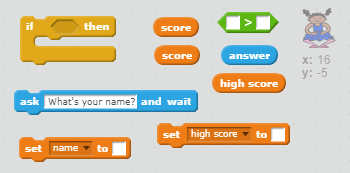

## 高分

让我们来保存高分，这样你便能与你的朋友进行比赛。

+ 向你的项目添加两个名为 `高分`{:class="blockdata"}和 `姓名`{:class="blockdata"}的新变量。

当游戏因玩家猜错序列而终止时，你需要检查他们的分数是否高于当前的高分。如果是，你需要将该分数储存为高分并储存玩家的姓名。

+ 向你的玩家子图添加代码来储存高分。还要询问玩家的姓名并将其记录在 `姓名`{:class="blockdata"}变量中。

[[[generic-scratch-high-score]]]

--- hints ---
--- hint ---
你的新代码需要遵循以下逻辑：
`游戏结束` 消息播放后
`如果` 该 `分数` `>` `高分`
将 `高分` `设定` 为该 `分数`
`询问` 玩家的姓名
将该 `姓名` `设定` 为 `回答`
--- /hint ---
--- hint ---
你将需要以下代码块：



--- /hint ---
--- hint ---
按下红色按钮时，你的代码应如下所示：

```blocks
	当收到消息 [red v]
  如果 <(item (1 v) of [sequence v] :: list) = [1]> 那么 
   删除第 (1 v) 项 \( [sequence v] \)

   说出 [Game over!] (1) 秒
   如果 <(score) > (high score)> 那么 
    变量 [high score v] 设为 (score)
    询问 [High score! What is your name?] 并等待
    变量 [name v] 设为 (询问的答案)
   end
   停止 [全部 v]
 end
```
--- /hint ---
--- /hints ---

+ 你还将需要对其他三种颜色的角色子图添加此新代码！你是否注意到了四种颜色中每一个的“游戏结束”代码都完全相同吗？


如果你需要更改此代码的任何一处，例如添加声音或更改“游戏结束”消息，你需要更改四次。这可能会很烦人，并浪费大量时间。

不过，你可以定义你自己的代码块，并在你的项目中重复使用。为此，请点击 `更多代码块`{:class="blockmoreblocks"}，然后点击**制作代码块**。将这个新代码块称为“游戏结束”。


+ 向你创建的代码块添加红色按钮相关的 `否则`{:class="blockcontrol"}代码块中的代码：


+ 你现在已经编写了名为 `游戏结束`{:class="blockmoreblocks"}的新_函数_，并且你可以用在任何地方。将你的新 `游戏结束`{:class="blockmoreblocks"}代码块拖到按钮的四个脚本上。


+ 现在添加一个在按错按钮时发出的声音。你仅需要在你编写的 `游戏结束`{:class="blockmoreblocks"}代码块中添加一次此代码，无需分别添加四次！


