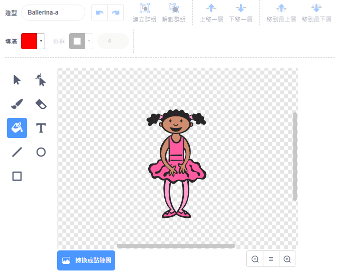
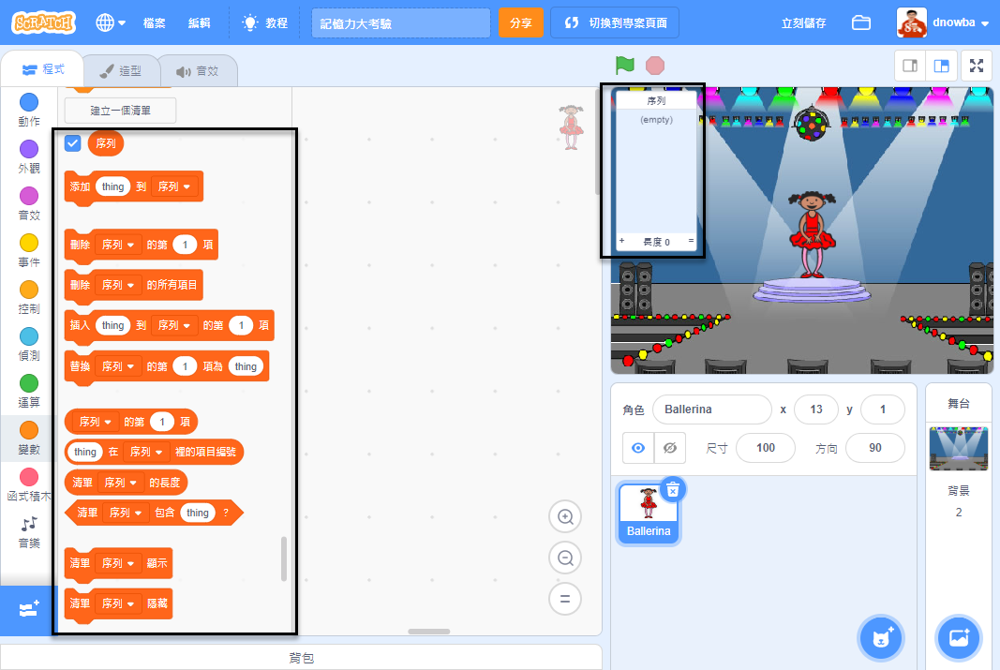

## 創建顏色序列

首先創建一個角色，角色會隨機顯示序列中某個顏色。

\--- task \---

建立一個新的 Scratch 專案。

**線上版：**你可以連結 [rpf.io/scratch-new](https://rpf.io/scratch-new){:target="_blank"} 以新建專案。

**離線版：**在離線編輯器的工作列中開啟選單並點擊新建專案。。

如果你需要 Scratch 離線版編輯器，可以連結到 [rpf.io/scratchoff](https://rpf.io/scratchoff){:target="_blank"}。

\--- /task \---

\--- task \---

選擇一個角色和一個背景，你可以使用 ballerina，她是個芭蕾舞者。你的角色不一定要是人，只要能顯示不同顏色就可以了。


\--- /task \---

+ 遊戲中，我們用不同的數字代表各種顏色：
    
    + 1 = 紅色
    + 2 = 藍色
    + 3 = 綠色
    + 4 = 黃色

\--- task \---

給你的角色四個造型，每個造型圖像的主要顏色改成你要的四種顏色。務必確認造型顏色的排序和上列的清單順序一致。


\--- /task \---

如果需要，你可以用「填滿」工具來幫造型圖像的主要形狀填入不同顏色。



接下來，建立一個清單，用來儲存玩家必須記住的顏色序列。

\--- task \---

建立一個清單，命名為 `序列`{:class="block3variables"}。 只有目前這個角色會用到這份清單，所以在清單建立時，你可以選擇**僅適用當前角色**。

[[[generic-scratch3-make-list]]]

\--- /task \---

現在，在變數類的積木裡會多出跟清單相關的積木，在舞台的左上角也會出現一個空的清單。



每個顏色有不同的代表數字，因此你可以用隨機取數的方式，將一連串的隨機數添加到清單裡，做為顏色選擇的依據。

\--- task \---

為角色添加這個程式，就可以把隨機數添加到`序列`{:class="block3variables"}裡：


```blocks3
當 @greenflag 被點擊
添加 (隨機取數 (1) 到 (4)) 到 [序列 v]
```

\--- /task \---

\--- task \---

測試你的程式，檢查是不是每次點擊綠旗時，清單中都會多一個 1 到 4 之間的隨機數。

\--- /task \---

\--- task \---

你可以編寫程式，讓它一次生成五個隨機數嗎？

\--- hints \---

\--- hint \---

在程式一開始先`刪除序列的所有項目`{:class="block3variables"}，這樣每次運行時就可以把序列清空，然後再`重複`{:class="block3control"}隨機取數與加入清單的動作五次。

\--- /hint \---

\--- hint \---

你的程式看起來應該像這樣：


```blocks3
當 @greenflag 被點擊
刪除 [序列 v] 的所有項目
重複 (5) 次
    添加 (隨機取數 (1) 到 (4)) 到 [序列 v]
end
```

\--- /hint \---

\--- /hints \---

\--- /task \---

\--- task \---

每次將數字加到清單時，角色都要更換造型，使造型的顏色與清單中的代表顏色的數字一致。 把這些程式貼合到`添加隨機數到序列`{:class="block3variables"}的下方：


```blocks3
造型換成 ((序列 v)的第(清單 [序列 v] 的長度)項)
等待 (1) 秒
```

\--- /task \---