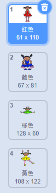
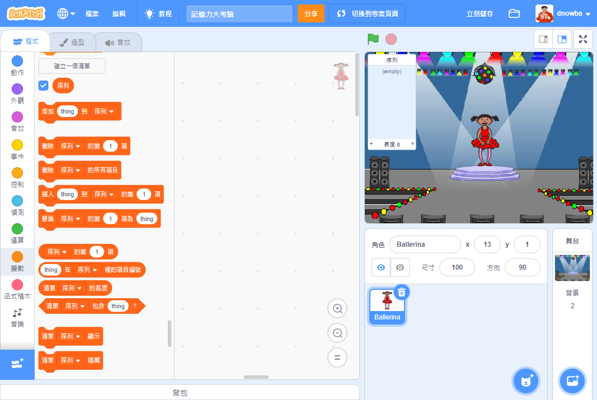

## 建立一個顏色序列

首先，讓我們建立一個角色，該角色將展示一個需要記住的隨機顏色序列。

+ 啟動一個新的 Scratch 專案，刪除貓子圖，使專案清空。你可以在 [這裡](http://jumpto.cc/scratch-new) 找到 Scratch 線上編輯器。

+ 選擇一個角色子圖和一個背景。你的角色不一定要是個人，但他們需要能夠展示不同的顏色。


+ 在你的遊戲中，你將使用不同的數字來代表每種顏色：

	+ 1 = 紅色
	+ 2 = 藍色
	+ 3 = 綠色
	+ 4 = 黃色

	賦予你的角色四種不同顏色的造型，每種造型對應上述四種顏色之一。確保你的彩色造型與上文列表的顏色順序一致。

	

讓我們來建立一個隨機的顏色序列。

+ 建立一個名為 `序列`{:class="blockdata"}的列表。我們將使用此列表儲存玩家需要記住的顏色序列。只有角色子圖需要看到該列表，因此你可以選擇**僅此子圖可見**。

[[[generic-scratch-make-list]]]

你現在應該可以在工作區左上方看到你的空白列表，以及大量使用列表的新程式碼塊。



+ 還記得我們為每個顏色賦予了一個數字嗎？我們可以通過選擇任意一個數字並將其新增到列表來選擇一個隨機顏色。新增此程式碼：

```blocks
點選綠旗時
新增專案 (隨機取數 (1) 到 (4)) \( [sequence v] \)
```

+ 點選綠色旗幟來測試你的程式碼。請檢查並確認，你每次點選時，1 到 4 之間的一個任意數字會被新增到列表。

+ 你能否將此程式碼塊新增到你的專案，從而一次生成五種隨機顏色？

```blocks
重複 (5) 次
end
```

+ 你可能注意到了你的列表此刻已經變得快滿了。讓我們在生成任何數字之前，首先新增一個程式碼塊來刪除整個列表。

```blocks
點選綠旗時
刪除第 (全部 v) 項 \( [sequence v] \)
重複 (5) 次 
  新增專案 (隨機取數 (1) 到 (4)) \( [sequence v] \)
end
```

+ 最後，讓我們在每次選擇一個數字時，將舞者的造型更換為向列表新增的最後一項，即我們剛剛選擇的數字。在你向你的列表新增隨機數字後，立即向你的程式碼新增以下程式碼塊：

```blocks
造型換成 (連結串列第 (last v) 項專案\( [sequence v] \) :: list)
等待 (1) 秒
```
