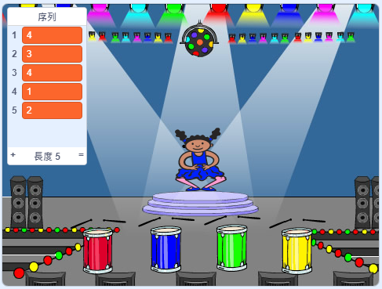

## 找出顏色序列

現在，你將加入四個顏色按鈕，玩家在記住角色的顏色更換順序後，要依照序列按下顏色按鈕才算成功。

\--- task \---

加入四個新的角色到專案，代表四個按鈕。

+ 編輯新角色的造型，把四個圖像的主要顏色分別換成要記憶的四個顏色。
+ 把角色放到舞台，擺放順序和顏色序列一致：紅色、藍色、綠色、黃色。



\--- /task \---

\--- task \---

為紅色按鈕角色編寫程式，在點擊角色時`廣播`{:class="block3events"}訊息「紅色」給其它角色：


```blocks3
    當角色被點擊
    廣播訊息 (紅色 v)
```

\--- /task \---

`廣播`{:class="block3events"}就好像現實生活中，有人拿著大聲公說話，在場的人都聽得到這個訊息，比方說學校的廣播、市場的廣播。 所有角色都「聽」得到這個`廣播`{:class="block3events"}，不過，你可以設定哪個角色要對哪種訊息有反應。

\--- task \---

為藍色、綠色、黃色的角色編寫類似的程式，讓各自`廣播`{:class="block3events"}自己的顏色訊息。

\--- /task \---

記得`廣播`{:class="block3events"}就像大聲公吧？ 你還要在角色加入一些程式，讓它對`廣播`{:class="block3events"}的訊息有反應。

\--- task \---

當你的角色收到`紅色`{:class="block3events"}這個訊息，要檢查所代表的數字 `1` 是不是和目前`序列`{:class="block3variables"}中的第一個項目所列的顏色代表數字一樣是`紅色`{:class="block3events"}。

如果清單的第一項是 `1`，表示玩家答對，程式會把這個項目刪除，以便玩家回覆序列的下一個答案。 如果玩家答錯，程式會`全部停止`{:class="block3control"}，表示遊戲結束。


```blocks3
當收到訊息 (紅色 v)
如果 <((序列 v) 的第 (1) 項) = (1)> 那麼
刪除 [序列 v] 的第 (1) 項
否則
說出 (遊戲結束！) 持續 (1) 秒
停止 [全部 v]
end
```

\--- /task \---

\--- task \---

在你剛編寫的程式裡也加入演奏節拍，這樣一來，`當角色收到的訊息`{:class="block3events"}是正確時，就會聽到音效。

\--- hints \---

\--- hint \---

你能為每個顏色演奏對應的鼓聲嗎？

+ 1 = 紅色
+ 2 = 藍色
+ 3 = 綠色
+ 4 = 黃色

\--- /hint \---

\--- hint \---

在`刪除序列的第 1 項`{:class="block3variables"}積木上方，添加`演奏節拍`{:class="block3sound"}積木， 這樣一來所演奏的音樂就會和清單中的`序列`{:class="block3variables"}一致。

\--- /hint \---

\--- hint \---

這是你需要添加的程式：

```blocks3
當收到訊息 (紅色 v)
如果 <((序列 v) 的第 (1) 項) = (1)> 那麼

+ 演奏節拍 ( (1)軍鼓 v) (0.25) 拍
刪除 [序列 v] 的第 (1) 項
否則
說出 (遊戲結束！) 持續 (1) 秒
停止 [全部 v]
end
```

\--- /hint \---

\--- /hints \---

\--- /task \---

\--- task \---

複製角色收到`紅色`{:class="block3events"}訊息的事件程式。 修改複製出來的積木，把它改成收到`藍色`{:class="block3events"}訊息時的反應。

\--- /task \---

當角色收到`藍色`{:class="block3events"}訊息的程式中，哪些是保持不變的，哪些又是應該修改的呢？ 要注意的是，不同的數字對應了不同的顏色。

\--- task \---

修改角色的程式，讓角色對`藍色`{:class="block3events"}訊息有正確的反應。

\--- hints \---

\--- hint \---

你需要修改這些積木的部分內容：


```blocks3
 <((序列 v) 的第 (1) 項) = (1)> 

當收到訊息 (紅色 v)

演奏節拍 ( (1)軍鼓 v) (0.25) 拍

```

\--- /hint \---

\--- hint \---

收到`藍色`{:class="block3events"}訊息時的程式應該會像這樣：


```blocks3
當收到訊息 (藍色 v)
如果 <((序列 v) 的第 (1) 項) = (2)> 那麼
    演奏節拍 ( (2)低音鼓 v) (0.25) 拍
    刪除 [序列 v] 的第 (1) 項
否則
    說出 (遊戲結束！) 持續 (1) 秒
    停止 [全部 v]
end
```

\--- /hint \---

\--- /hints \---

\--- /task \---

\--- task \---

再複製出兩段程式，用來回應綠色、黃色按鈕的廣播，記得要修改必要的部分，這樣角色才能夠對`廣播`{:class="block3events"}事件有正確的反應。

\--- /task \---

記得要測試程式！你能記得住五個顏色的序列嗎？每次顏色的排列順序是不是不一樣？

當玩家正確回答出顏色的排列順序，就把`序列`{:class="block3variables"}清空，同時慶祝玩家成功。 怎麼慶祝呢？在`序列`{:class="block3variables"}清空後，可以廣播告訴舞台，讓舞台的燈光閃爍。

\--- task \---

把這個程式安排到`點擊綠旗`{:class="block3events"}之後：


```blocks3
    等待直到 <(清單 [序列 v] 的長度) = (0)>
    廣播訊息 [成功 v] 並等待
```

\--- /task \---

\--- task \---

切換到舞台的程式頁籤，播放你喜歡的音效，比方說範例庫中的音效 `Drum Machine`。

[[[generic-scratch3-sound-from-library]]]

\--- /task \---

\--- task \---

在舞台上編寫這個程式，玩家在記憶成功時，就會有慶祝音樂，同時背景圖像的顏色也會改變（看來就像燈光在閃爍）。


```blocks3
    當收到訊息 (成功 v)
    播放音效 (Drum Machine v)
    重複 (40) 次
        圖像效果 [顏色 v] 改變 (25)
        等待 (0.1) 秒
    end
    圖像效果清除
```

\--- /task \---