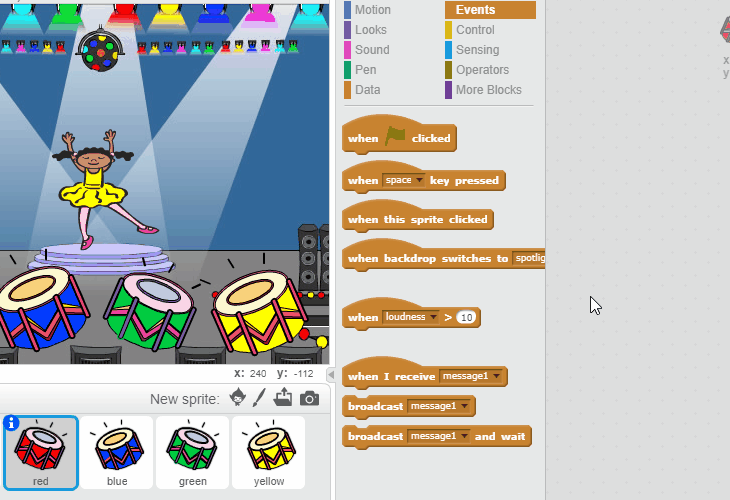

## 重複序列

讓我們新增四個按鈕，玩家通過按下這些按鈕來重複他們記住的序列。

+ 向你的專案新增四個新子圖來代表四個按鈕。編輯造型讓四種顏色中的每種都對應一個子圖。將子圖按照與造型顏色一致的順序排列 — 紅色、藍色、綠色、黃色。


+ 點選紅色鼓時，你將需要向你的角色廣播一條資訊，使他們知道紅色按鈕已被點選。向你的紅色鼓新增此程式碼：

```blocks
	當角色被點選
  廣播訊息 [red v]
```

廣播有點像通過揚聲器發出一條公告 — 你可能會在超市購物時聽到這種公告。所有子圖都可聽到此訊息，但只有擔任響應職責的子圖才會採取行動。

+ 向藍色、綠色和黃色鼓新增類似程式碼，使其廣播有關自身顏色的訊息。

--- hints ---
--- hint ---
以下為從一個子圖向另一個複製程式碼的一種簡單方式。更改每個子圖中的廣播資訊以匹配子圖的顏色。

--- /hint ---
--- /hints ---

還記得我們說過廣播有點像通過揚聲器發出一條公告嗎？只有擔任響應職責的子圖才會採取行動，因此我們來讓角色子圖擔任起對資訊做出響應的職責。我們通過為角色編寫某些程式碼使其在聽到每條資訊時有所行動來做到這一點。

 + 你的角色子圖收到 `紅色` 資訊時，程式碼應檢查數字 `1` 是否位於列表的開始位置（這意味著 `紅色` 是序列中的下一個顏色）。

 如果是，程式碼應將該數字從列表中移除，因為對顏色的猜測正確。否則遊戲結束，我們則需要 `停止全部`{:class="blockcontrol"}來停止遊戲。

```blocks
	當收到訊息 [red v]
  如果 <(item (1 v) of [sequence v] :: list) = [1]> 那麼 
   刪除第 (1 v) 項 \( [sequence v] \)

   說出 [Game over!] (1) 秒
   停止 [全部 v]
  end
```

+ 新增到你剛剛編寫的程式碼中，使得收到正確顏色時也能播放鼓聲。

--- hints ---
--- hint ---
你能否使用與每種顏色相對應的數字來播放正確的鼓聲？
+ 1 = 紅色
+ 2 = 藍色
+ 3 = 綠色
+ 4 = 黃色
--- /hint ---
--- hint ---
你將需要新增 `彈奏鼓聲`{:class="blocksound"}程式碼塊，以在 `刪除序列的第 1 項`{:class="blockdata"}之前播放順序列表中的第一個聲音：


--- /hint ---
--- hint ---
以下是你將需要新增的程式碼：

```blocks
 演奏節拍 (連結串列第 (1 v) 項專案\( [sequence v] \) :: list) (0.25) 拍
```
--- /hint ---
--- /hints ---

+ 複製你用來使你的角色子圖對資訊 `紅色` 做出迴應的程式碼。這次，將資訊變更為 `藍色`。

子圖對資訊 `藍色` 做出迴應時，哪段程式碼應保持原樣，哪段應做出變動？請記住每種顏色都有一個對應的數字。

+ 更改你的程式碼，使角色對 `藍色` 資訊做出正確迴應。

--- hints ---
--- hint ---
保留這些程式碼塊，但你將需要在一定程度上進行更改：

--- /hint ---
--- hint ---
你的藍色廣播程式碼應如下所示。

```blocks
	當收到訊息 [blue v]
  如果 <(item (1 v) of [sequence v] :: list) = [2]> 那麼 
   演奏節拍 (連結串列第 (1 v) 項專案\( [sequence v] \) :: list) (0.25) 拍
   刪除第 (1 v) 項 \( [sequence v] \)

   說出 [Game over!] (1) 秒
   停止 [全部 v]
end
```

--- /hint ---
--- /hints ---

+ 再次為綠色和黃色按鈕複製兩次該程式碼，並更改必要的部分，使得角色能做出正確迴應。

+ 請記得測試你所新增的程式碼！你能記住五種顏色的序列嗎？序列是否每次都不一樣？

列表清空後，你還可以展示一些閃光燈作為獎勵，因為這意味著正確記住了整個序列。

+ 向你角色的 `當綠色旗幟被點選`{:class="blockevents"}指令碼的末端新增此程式碼：

```blocks
	等待直到 <(length of [sequence v] :: list) = [0]>
  廣播訊息 [won v] 並等待
```

+ 切換到工作區，然後新增此程式碼來播放聲音並使背景在玩家勝利時改變顏色。你可以選擇任何你喜歡的聲音。

```blocks
	當收到訊息 [won v]
  播放音效 [drum machine v]
  重複 (50) 次 
   效果 [顏色 v] 改變 (25)
   等待 (0.1) 秒
  end
  效果清除
```
