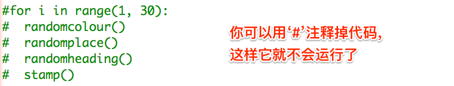

## 建立矩形現代藝術

現在讓我們通過繪製大量不同大小和顏色的矩形來建立一些現代藝術。

+ 首先，在你的挑戰程式碼後面，將以下程式碼新增到指令碼底部，以清除繪製海龜藝術後的螢幕，並將烏龜指向其通常的方向：
    
    

+ 你可以在每一行開頭用`#`註釋海龜藝術的程式碼，這樣在創作矩形藝術的時候它就不會執行了。 (之後可以取消註釋來展示您所有的作品。)
    
    

+ 現在，讓我們新增一個函式，以便在隨機的位置繪製一個大小隨機，顏色隨機的矩形！
    
    在其他函式後新增一個 `drawrectangle()` 函式：
    
    
    
    如果你想節省一些輸入時間，可以在`snippets.py`中尋找一些幫助程式碼。

+ 在`main.py`的底部新增以下程式碼來呼叫你的新函式：
    
    
    
    多次執行你的指令碼，看看高度和寬度的變化。

+ 矩形總是以同一種顏色，並從同一個位置開始。
    
    現在你需要為海龜隨機設定一個顏色，然後移動到隨機位置。 嘿，你不是已經建立了函式來做這些嗎？ 太棒了。 你只需要從drawrectangle函式開始處呼叫它們：
    
    
    
    哇，工作量少了很多，而且閱讀起來也容易得多。

+ 現在讓我們在一個迴圈中呼叫 `drawrectangle()` 來建立一些很酷的現代藝術：
    
    

+ 天哪，那不是有點慢嗎！ 幸運的是，你可以加快海龜的速度。
    
    找到將形狀設定為“turtle”的程式碼行，並新增高亮的程式碼：
    
    
    
    `speed(0)`是最快的，或者您可以使用1（慢）到10（快速）之間的數字進行實驗，直到找到所需的速度為止。