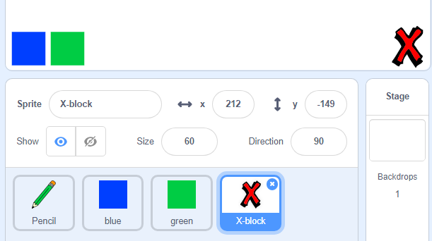

## Undo mistakes

Sometimes mistakes happen, so add a 'clear' button and an eraser button.

--- task ---

Add the 'X-block' sprite from the library's letters section. Colour the sprite's costume in red and make it a little smaller. This sprite is the 'clear' button.

[[[generic-scratch3-sprite-from-library]]]



--- /task ---

--- task ---

Add code to the 'X-block' sprite to clear the Stage when the sprite clicked.


```blocks3
when this sprite clicked
erase all
```

--- /task ---

You don't need to use a `broadcast`{:class="block3events"} to clear the Stage, because the `erase all`{:class="block3extensions"} block does that job.

Do you see that the pencil sprite includes an eraser costume?


Your project also includes a separate eraser sprite. 

--- task ---

Right-click on this eraser sprite and then click on **show**. Here is how your Stage should look now:


--- /task ---

--- task ---

Add code to the eraser sprite to send an `'eraser' broadcast`{:class="block3events"} when the eraser sprite is clicked.


```blocks3
when this sprite clicked
broadcast (eraser v)
```

--- /task ---

When the pencil sprite receives the 'eraser' message, it should switch its costume to the eraser and switch the pen colour to white, which is the same colour as the Stage!

--- task ---

Add some code to create the eraser.

--- hints ---
--- hint ---

Add some code to the pencil sprite:
`When I receive`{:class="block3events"} the `eraser`{:class="block3events"} message
`Switch to costume eraser`{:class="block3looks"} 
`Set pen color`{:class="block3extensions"} to white

--- /hint ---
--- hint ---

Here are all the blocks you need:

```blocks3
set pen color to [#FFFFFF]
when I receive [eraser v]

switch costume to (eraser v)
```

--- /hint ---
--- hint ---

Here is what the code should look like:


```blocks3
when I receive [eraser v]
switch costume to (eraser v)
set pen color to [#FFFFFF]
```

--- /hint ---
--- /hints ---
--- /task ---

--- task ---

Test your project to see if you can clear the Stage and erase pencil lines.


--- /task ---

There's one more problem with the pencil: you can draw anywhere on the Stage, including near the 'clear' and eraser buttons!


--- task ---

To fix this, change the code so that the pen is only down if the mouse is clicked __and__ the `y` position of the mouse pointer is greater than `-120`:


```blocks3
when flag clicked
erase all
switch costume to (pencil-blue v)
set pen color to [#0035FF]
forever
  go to (mouse pointer v)
+if <<mouse down?> and <(mouse y) > [-120]>> then 
  pen down
  else
  pen up
end
```

--- /task ---

--- task ---

Test your project. You now should not be able to draw near the buttons.


--- /task ---
