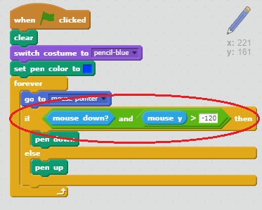

## 出错

有时可能会出错，因此让我们来向你的项目添加一个“清除”按钮和一个橡皮擦！


+ 让我们添加一个按钮来清空工作区。为此，向工作区添加“X-block”字母子图并将其变为红色。

	

+ 向你的新取消按钮添加代码，使其在被点击时清空工作区。

	```blocks
		当角色被点击
    笔迹清除
	```

	请注意你无需发送消息来清空工作区，因为任何子图都能做到！

+ 你可能注意到了你的铅笔子图包含一个橡皮擦造型：

	
	

+ 你的项目还包含一个橡皮擦选择器子图，右键单击并选择“显示”。你的工作区应如下所示：

	

+ 你随后可以向橡皮擦选择器子图添加代码，告诉铅笔切换为橡皮擦。

	```blocks
		当角色被点击
    广播消息 [eraser v]
	```

+ 铅笔收到此消息时，你可以通过将铅笔造型切换为橡皮擦来创建一个橡皮擦，并将铅笔颜色变为与工作区同样的颜色！

	```blocks
		当收到消息 [eraser v]
    造型换成 [eraser v]
    笔迹颜色设为 [#FFFFFF]
	```

+ 测试你的项目，看看你能否在工作区进行清空和擦除。

	

+ 铅笔还有一个问题 - 你可以在工作区的任何地方进行绘图，包括选择器图标附近！

	

	为解决这个问题，你必须告诉铅笔只能在鼠标被点击_和_鼠标的 y 坐标大于 -120（`鼠标的 y 坐标`）时进行绘图，语句如下所示：

	

+ 测试你的项目，你现在应该无法在选择器模块附近进行绘图。

	


