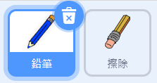
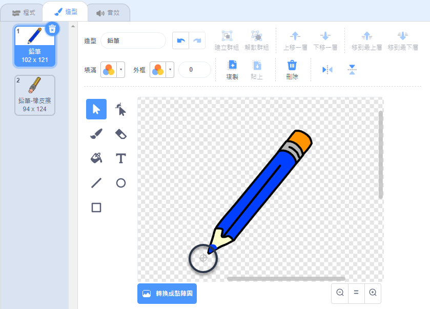

## 做個鉛筆

首先製作一支可以在舞台上畫畫的鉛筆。

\--- task \---

打開畫圖工具盒這個專案的材料包。

**線上版**：你可以連結 [rpf.io/paint-box-on](http://rpf.io/paint-box-on){:target="_blank"} 以新建專案。

如果你有 Scratch 帳戶，你就可以直接**改編**專案。

**離線版**：在離線編輯器裡開啟[材料包](http://rpf.io/p/en/paint-box-go){:target="_blank"}。

如果你需要 Scratch 離線版編輯器，可以連結到 [rpf.io/scratchoff](http://rpf.io/scratchoff){:target="_blank"}。

在材料包中，你應該會看到「鉛筆」和「擦除」兩個角色：



\--- /task \---

\--- task \---

把畫筆這個擴充功能添加到專案裡。

[[[generic-scratch3-add-pen-extension]]]

\--- /task \---

\--- task \---

為鉛筆角色編寫一個程式，讓角色`重複不停`{:class="block3control"}的跟著滑鼠游標，這樣你才可以在舞台上任何地方畫圖：


```blocks3
當 @greenflag 被點擊
重複無限次
  定位到 (鼠標 v) 位置
end
```

\--- /task \---

\--- task \---

點擊綠旗，然後移動滑鼠，測試一下你的程式是否正常運作。

\--- /task \---

接著，`如果`{:class="block3control"}滑鼠按鍵的話，那麼就下筆畫畫；否則就停筆不畫。

\--- task \---

添加程式到鉛筆角色裡：


```blocks3
當 @greenflag 被點擊
重複無限次
  定位到 (鼠標 v) 位置

+ 如果 <滑鼠鍵被按下？> 那麼
  下筆
  否則
  停筆
end
```

\--- /task \---

\--- task \---

再試試你的程式。 這次，在舞台隨意的移動鉛筆，然後按住滑鼠按鍵。 你可以用鉛筆畫圖了嗎？


\--- /task \---

## \--- collapse \---

## title: 筆跡不是從鉛筆筆尖上畫出來的嗎？

如果不像是從鉛筆筆尖畫出來的感覺，那你可以去修改角色的造型，把鉛筆尖端的部分移動到繪圖畫布的中心點。

點擊鉛筆這個角色，然後換到**造型**頁籤。

移動造型的位置，把筆尖放到畫布的中心點位置上。



現在再畫畫看。 筆跡應該會從鉛筆的尖端出現了。

\--- /collapse \---