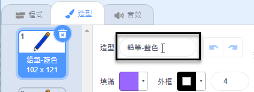
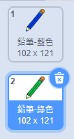
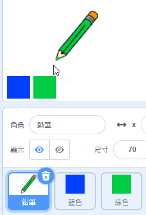

## 不同顏色的鉛筆

現在，你將添加不同顏色的鉛筆到專案裡，使用的人可以選擇這些顏色來畫畫。

\--- task \---

點擊`鉛筆`這個角色，切換到造型頁籤，將造型名稱重新命名成`鉛筆-藍色`。



\--- /task \---

\--- task \---

在「鉛筆-藍色」造型上按下滑鼠右鍵，複製這個造型。


\--- /task \---

\--- task \---

將造型名稱修改為「鉛筆-綠色」，然後把鉛筆塗成綠色。



\--- /task \---

\--- task \---

接著創建兩個角色：一個是藍色的正方形，一個是綠色的正方形。 這是使用者用來選擇筆的顏色的工具方塊。



\--- /task \---

\--- task \---

把這兩個角色分別命名成「藍色」和「綠色」。

[[[generic-scratch3-rename-sprite]]]

\--- /task \---

\--- task \---

為「綠色」角色編寫程式，在點擊角色時`廣播`{:class="block3events"}「換成綠色」的訊息。


```blocks3
當角色被點擊
廣播訊息 (換成綠色 v)
```

[[[generic-scratch3-broadcast-message]]]

\--- /task \---

鉛筆角色要在接收到「換成綠色」這個廣播訊息後，應該要把造型換成綠色的鉛筆。

\--- task \---

點擊鉛筆角色， 添加一些程式，讓角色在收到訊息`換成綠色`{:class="block3events"}時，角色會切換成綠色鉛筆的造型，然後筆跡的顏色也變成綠色。


```blocks3
當收到訊息 (換成綠色 v)
造型換成 (鉛筆-綠色 v)
筆跡顏色設為 [#00CC44]
```

要設定筆跡成綠色的方式是，在`筆跡設為…`{:class="block3extensions"}積木上的色塊上點一下，接著點擊顏色工具底部的揀色工具（滴管圖示），然後再選綠色正方形，就可以揀到一模一樣的綠色。

\--- /task \---

在藍色鉛筆上的程式和綠色鉛筆的很像。

\--- task \---

選取藍色這個角色，添加這個程式：


```blocks3
當角色被點擊
廣播訊息 (換成藍色 v)
```

然後選取鉛筆角色，加入這個程式：


```blocks3
當收到訊息 (換成藍色 v)
造型換成 (鉛筆-藍色 v)
筆跡顏色設為 [#0035FF]
```

\--- /task \---

\--- task \---

最後，添加這個程式，告訴鉛筆角色開始時要用的顏色，還有確保程式啟動時畫面是清空的。


```blocks3
當 @greenflag 被點擊
+ 筆跡全部清除
+ 造型換成 (鉛筆-藍色 v)
+ 筆跡顏色設為 [#0035FF]
重複無限次
  定位到 (鼠標 v) 位置
如果 <滑鼠鍵被按下？> 那麼
  下筆
  否則
  停筆
end
```

\--- /task \---

如果你可以的話，你可以加入更多不同顏色的鉛筆。

\--- task \---

測試你的程式。 你可以在藍色和綠色鉛筆之間來回切換並畫出不同顏色的筆跡嗎？


\--- /task \---