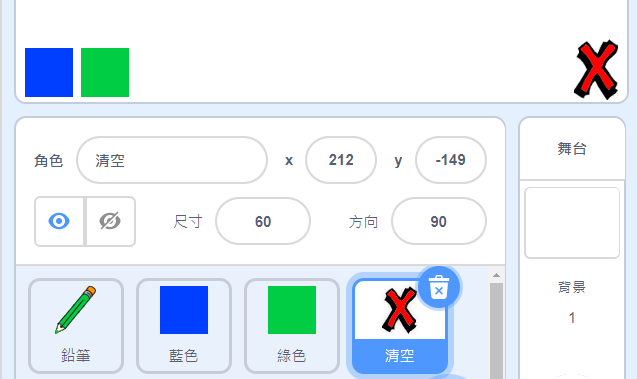
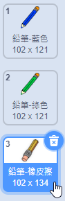

## 清空與擦除

有時候我們會畫錯些東西，有個「清空」和「擦除」的工具會很方便的。

\--- task \---

加入一個有叉叉樣式的角色，你可以用英文字母 X 來代表。 把角色的造型塗成紅色，然後變小一些。 這個角色用來當作「清空」按鈕。

[[[generic-scratch3-sprite-from-library]]]



\--- /task \---

\--- task \---

為清空按鈕編寫程式，在點擊角色時，把舞台上的所有筆跡都清除。


```blocks3
當角色被點擊
筆跡全部清除
```

\--- /task \---

在這裡，你不需要用`廣播`{:class="block3events"}的方式，因為`筆跡全部清除`{:class="block3extensions"}這個程式積木就可以完成這件工作。

你觀察到了嗎？鉛筆角色裡頭，是不是有個橡皮擦的造型。



然後，你的專案也有角色的造型是橡皮擦，名稱叫做「擦除」。

\--- task \---

選取「擦除」這個角色，然後把它從隱藏切換成**顯示**。 這樣一來，舞台上就會看到這個角色了：


\--- /task \---

\--- task \---

為「擦除」這個角色編程，讓它在被點擊時發送一個`換成橡皮擦`{:class="block3events"}的廣播訊息。


```blocks3
當角色被點擊
廣播訊息 (換成橡皮擦 v)
```

\--- /task \---

當鉛筆收到了「換成橡皮擦」的訊息後，它應該要把造型改變成橡皮擦的樣子，而且筆跡的顏色變成和舞台背景相同的顏色，也就是白色，這樣在使用時就會有擦除的效果了！

\--- task \---

編寫一個橡皮擦效果的程式。

\--- hints \--- \--- hint \---

在鉛筆角色裡添加一些程式： `當收到訊息`{:class="block3events"}`換成橡皮擦`{:class="block3events"} `造型換成鉛筆-橡皮擦`{:class="block3looks"} `筆跡顏色設為`{:class="block3extensions"}白色

\--- /hint \--- \--- hint \---

這裡是你需要的程式積木：

```blocks3
筆跡顏色設為 [#ffffff]
當收到訊息 (換成橡皮擦 v)

造型換成 (鉛筆-橡皮擦 v)
```

\--- /hint \--- \--- hint \---

你的程式看起來應該像這樣：


```blocks3
當收到訊息 (換成橡皮擦 v)
造型換成 (鉛筆-橡皮擦 v)
筆跡顏色設為 [#ffffff]
```

\--- /hint \--- \--- /hints \--- \--- /task \---

\--- task \---

測試你的專案，看看這個程式是否可以有擦除舞台上筆跡的效果。


\--- /task \---

鉛筆的部分還有一個問題：你可以在舞台的任何地方畫圖，包含「清空」和「擦除」按鈕兩個區塊！


\--- task \---

要修復這個錯誤的方式，就是修改可以畫畫的程式，除了滑鼠左鍵按住之外，**同時**滑鼠游標的 `y` 座標必須要大於 `-120`：


```blocks3
當 @greenflag 被點擊
筆跡全部清除
造型換成 (鉛筆-藍色 v)
筆跡顏色設為 [#0035FF]
重複無限次
  定位到 (鼠標 v) 位置
+ 如果<滑鼠鍵被按下？> 且 <(鼠標的 y) > (120)>那麼
  下筆
  否則
  停筆
end
```

\--- /task \---

\--- task \---

測試你的專案。 現在你應該沒有辦法在按鈕附近畫畫了。


\--- /task \---