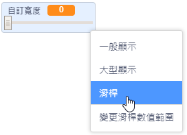
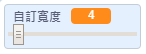

## 改變鉛筆的寬度

接著，你將編寫一個程式，讓使用你的繪圖工具的人，能夠自己決定鉛筆筆跡的粗細。

\--- task \---

首先，先建立一個新的變數，名稱叫`自訂寬度`{:class="block3variables"}。

[[[generic-scratch3-add-variable]]]

\--- /task \---

\--- task \---

在鉛筆角色的程式，找到`重複無限次`{:class="block3control"}這個迴圈，**在迴圈裡頭**添加一些程式：

```blocks3
當 @greenflag 被點擊
筆跡全部清除
造型換成 (鉛筆-藍色 v)
筆跡顏色設為 [#0035FF]
重複無限次
定位到 (鼠標 v) 位置
+ 筆跡寬度設為 (自訂寬度 :: variables)
如果<滑鼠鍵被按下？> 且 <(鼠標的 y) > (120)>那麼
  下筆
  否則
  停筆
end
```

\--- /task \---

現在鉛筆筆畫的粗細就可以透過`自訂寬度`{:class="block3variables"}這個變數來設定了。

\--- task \---

在舞台上找到`自訂寬度`{:class="block3variables"}，滑鼠游標停在這個變數上並點擊右鍵，然後選取**滑桿**。



\--- /task \---

這樣一來，拖曳變數下方的滑桿，就可以設定變數的值了。



\--- task \---

測試你的專案，試試看你能不能修改筆跡的寬度。


\--- /task \---