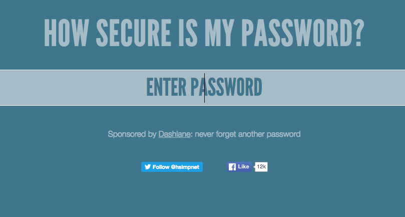

## 你的密碼有多安全？

電腦可以試著用'暴力法'猜出你的密碼是什麼 -- 意思是它會嘗試多種多種可能直到猜出正確答案。

讓我們來試試看電腦猜出你的密碼需要多久的時間。

+ 造訪 <a href="https://howsecureismypassword.net/" target="_blank">howsecureismypassword.net</a>，這個網站可以讓你知道你的密碼有多安全。

	

+ 輸入 "letmein" (Let me in) 作為密碼。 你會看到電腦 __馬上__猜出你的密碼！

	

	你會看到為什麼 "letmein"不是一組好密碼的原因：

　+ 這是非常 __常見的__ 密碼 （十五組最常使用的密碼之一）。電腦會先對這些密碼進行猜測。

　+ 它包含來自 __字典__的詞語。 電腦也會先對這些詞語進行猜測。

　+ 它非常的 __短__。 如果密碼更長的話電腦要花更多時間來破解。

　+ 它只包含 __字母__。 密碼如果包含數字或標點符號會更加安全。

+ 試著輸入字典中的詞語。看看電腦猜出密碼要花多久的時間？ 

