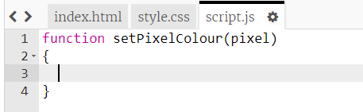

## 为像素着色

本项目使用三种不同的语言：
- HTML 用于组织你的内容
- CSS 告诉内容使用样式实现什么样的外观
- JavaScript 是一种编程语言，你可以用来使网页在你与其交互时做出回应

让我们添加一些 JavaScript 代码，使像素在你点击时自动着色。

我们将创建一个**函数**。函数为执行特定任务的指定代码块。我们想运行函数中包含的代码时，可以通过其名称来**调用**函数。

+ 在 `script.js` 文件内部创建一个名为 `setPixelColour`（设置像素颜色）的函数。`setPixelColour`（设置像素颜色）函数需要将一个 `pixel`（像素）作为**输入项**，以便其更改该像素的颜色。

+ 将此代码添加在函数内部来设置像素的背景颜色：

请注意 `backgroundColor`（背景颜色）使用了“colour”（颜色）的美式拼写。

此时，此代码不具备任何效力。

+ 转到 `index.html` 并向第一个像素添加以下代码，使得你点击此像素时，​`setPixelColour`（设置像素颜色）函数被调用：

括号中的 `this`（这个）为 `setPixelColour`（设置像素颜色）函数的输入项，它告知函数来为哪个像素设置颜色 — 即 `this`（这个）像素！

+ 点击第一个像素来测试你的代码。像素应变为黑色。

你仅仅向**第一个**像素添加了 `onclick`（单击）代码，因此现在点击其他像素不会有任何效果。
