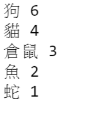
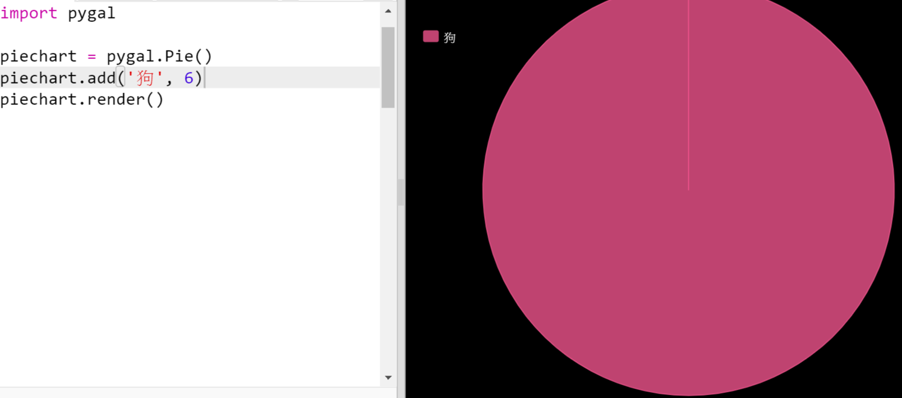
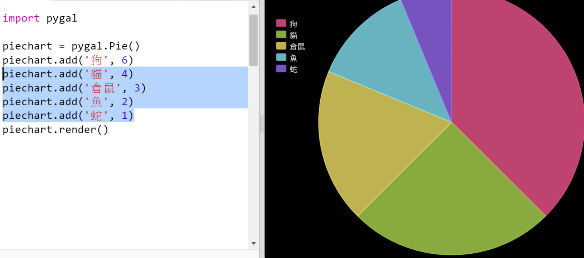
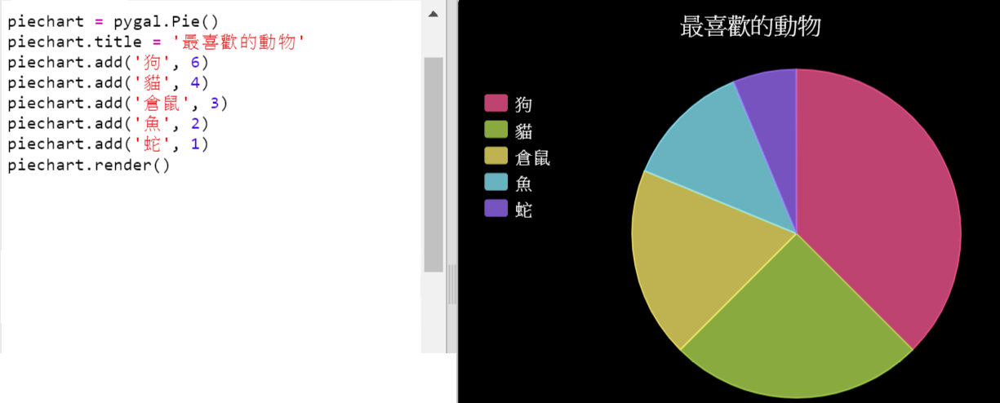

## 建立一個圓餅圖

圓餅圖是顯示資料的一種有效方式。讓我們在你的 Code Club 中進行一項最喜愛動物的調查，然後將相關資料以圓餅圖顯示出來。

+ 請你的老師幫忙組織一場調查。你可以將調查結果記錄在連線投影儀的電腦上或大家都可以看到的白板上。

  列出一份寵物清單，裡面要包含每個人最喜愛的寵物。

  然後請每個人在念到自己最愛的寵物時舉手，以此來進行投票。每個人只能投一票！

  例如：

  

+ 開啟空白 Python 模版 Trinket：[jumpto.cc/python-new](http://jumpto.cc/python-new){:target="_blank"}。

+ 讓我們建立一個圓餅圖來顯示你的調查結果。你將使用 PyGal 庫來進行一些困難的工作。

  首先匯入 Pygal 庫：

  

+ 現在讓我們建立一張圓餅圖並將其呈現（顯示）出來：

  

  不要擔心，你新增資料之後會變得更加有趣！

+ 讓我們來新增其中一種寵物的資料。運用你所收集的資料。

  

  因為只有一條資料，所以它佔據了整張圓餅圖。

+ 現在以同樣的方式新增其他資料。

  例如：

  

+ 為完成你的圖表，請新增一個標題：

  

