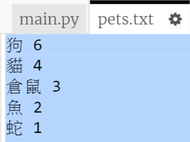
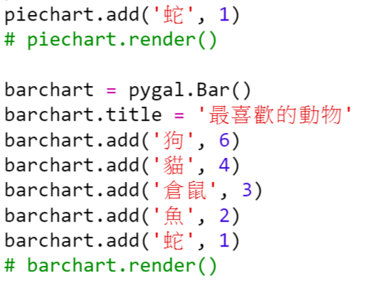
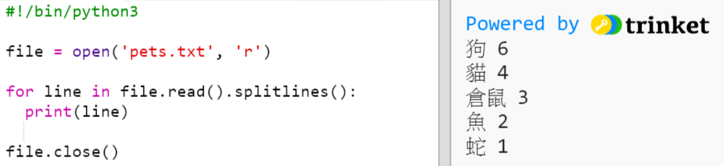
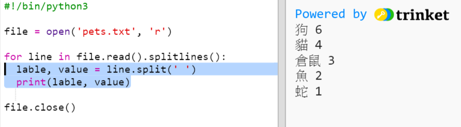
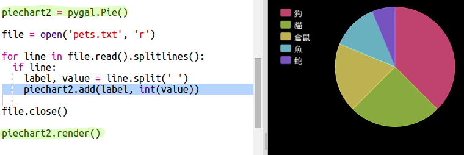

## 從檔案讀取資料

能夠在檔案中儲存資料而不是必須將資料新增到你的程式碼中，這一點非常有用。

+ 向你的專案新增一個新檔案並命名為 `pets.txt`：

  

+ 現在向該檔案新增資料。你可以使用你收集的最喜愛寵物的資料或者示例資料。

  

+ 切換回 `main.py` 並註釋掉呈現（顯示）圖表和圖形的相關行（使其不被顯示出來）：

  

+ 現在讓我們從檔案中讀取資料。

  

  `for` 迴圈將迴圈遍歷檔案中的多行內容。`splitlines()` 將換行符從行末移除，因為你不需要它。

+ 每行需要被分成一個標籤和一個值：

  

  將以空格來分行，因此請不要在標籤中加入空格。（你可以隨後在標籤中新增對空格的支援。）

+ 你可能會遇到如下所示的錯誤：

  

  如果你的檔案末尾存在空行，就會出現這種情況。

  如果該行不是空行，你只需通過獲取標籤和值來修復這個錯誤。

  為此，在你的 `for` 迴圈內部縮排相關程式碼並在其上方新增 `if line:` 程式碼：

  

+ 現在你可以將 `print(label, value)` 行移除，一切正常。

+ 現在讓我們來向新的餅圖新增標籤和值，並將其顯示出來：

  

  請注意 `add` 預期的值應為一個數字，`int(value)` 將值從字串轉換為整數。

  如果你想使用 3.5 之類的小數（浮點數），你可以使用 `float(value)` 代替。

