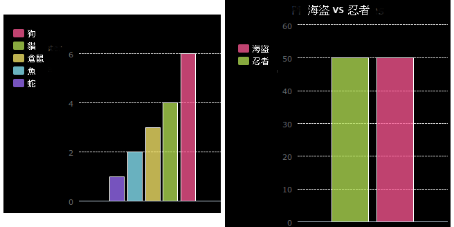

--- challenge ---
## 挑戰：建立你自己的長條圖

你可以按類似方式建立長條圖。只需使用 `barchart = pygal.Bar()` 來建立一個新的長條圖，然後新增資料並按與圓餅圖同樣的方式呈現出來。

向你的同學們收集資料來建立你自己的長條圖。

請務必選擇一個大家都瞭解的話題！

以下是一些想法：

 + 你最愛的運動是什麼？
 + 你最愛的冰淇淋口味是什麼？
 + 你怎麼去學校？
 + 你的生日在哪個月份？
 + 你玩 Minecraft 嗎？（是／否）

請不要問一些需提供個人資料的問題，如大家住在哪裡。如果你不確定，請詢問你的老師。

示例：

--- /challenge ---