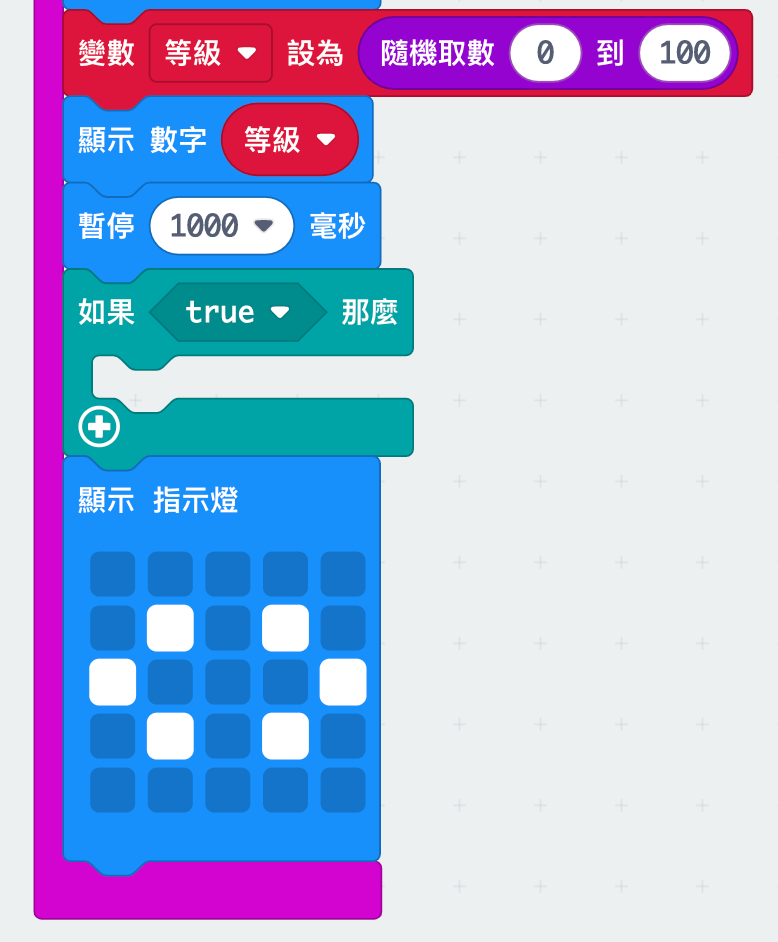
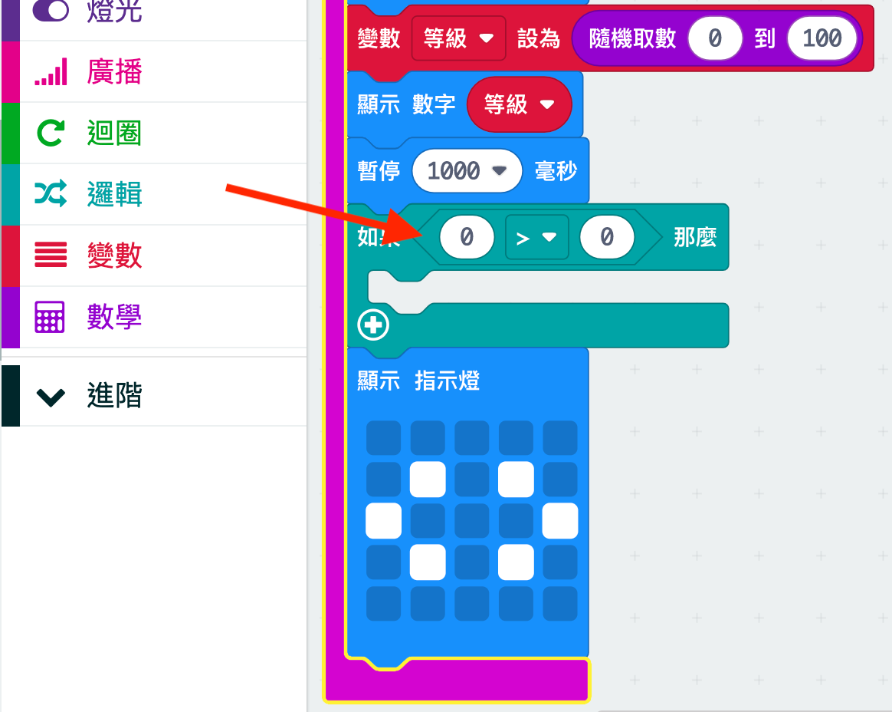
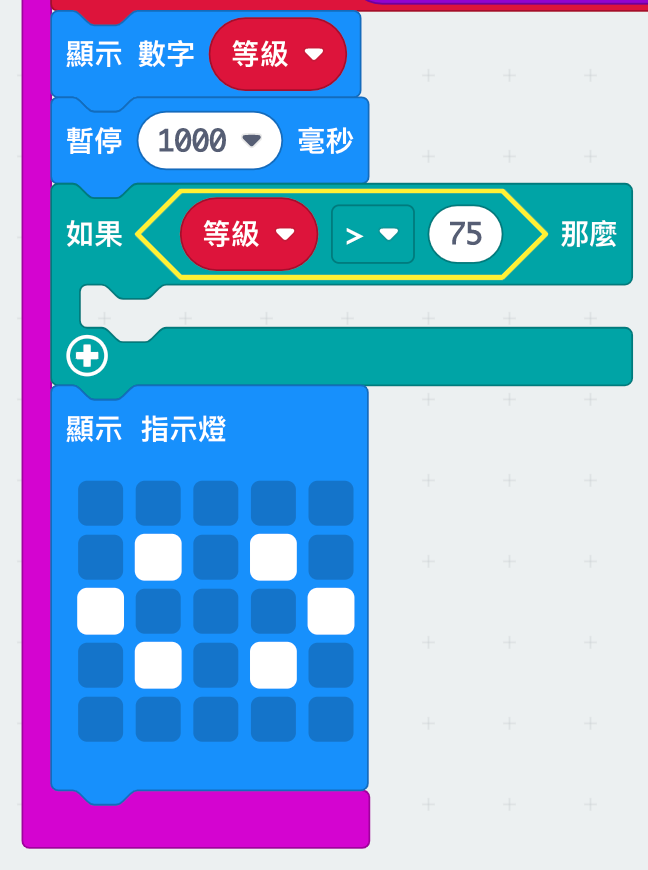
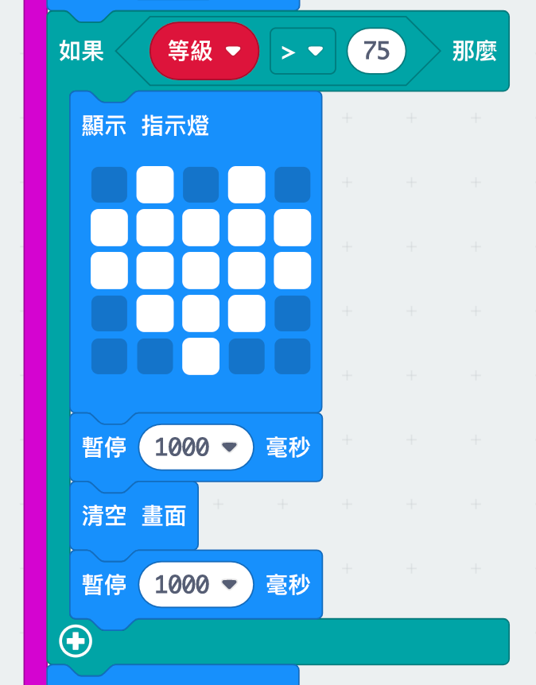

## Best mates

Let's display a heart when two friends have a high rating.

+ Add an `if` block to your code, just before the instructions are shown.

+ You want to display a heart if the rating is high (say over 75). To do this, drag a comparison block from 'Logic' to your 'if' and select '>':

+ Drag your `rating` variable into the left side of your `if` block, and add the number `75` to the right side.

Any code inside this `if` block will run if the rating is over 75.

+ Show a heart image on the screen for 1 second if the rating is over 75.

+ Test your code. Does an image of a heart show if the rating is over 75? You might have to try a few times to test it!

