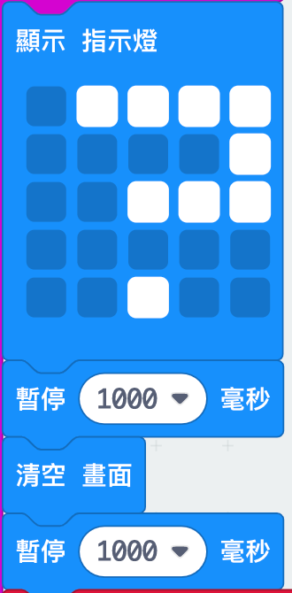
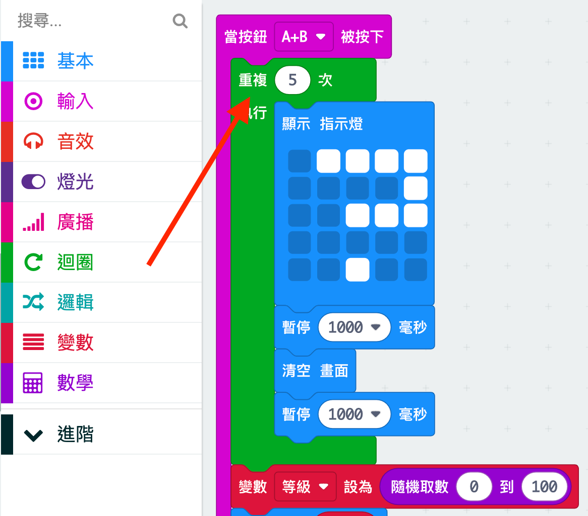

## Adding an animation

Let's display short animations in your program.

+ Here's the code for displaying a question mark for 1 second before clearing the screen:

+ To make this question mark flash 5 times, you'll need to put this code inside a `repeat` loop and set the number of repeats to '5':

