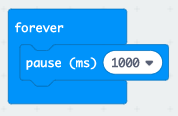
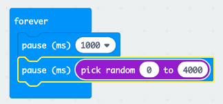
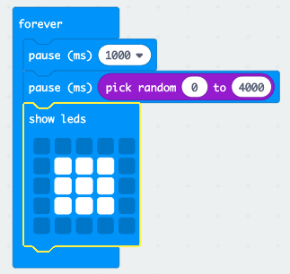
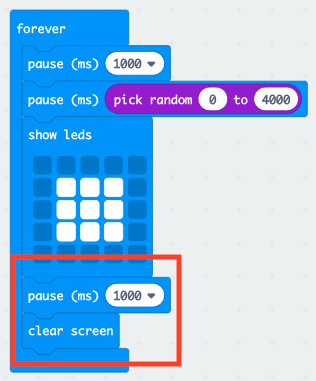

## Wait for it!

Let's start by displaying an image after a random amount of time.

+ Go to <a href="https://rpf.io/microbit-new" target="_blank">rpf.io/microbit-new</a> to start a new project in the MakeCode (PXT) editor. Call your new project 'Reaction'. 

+ Before displaying an image, the game should wait for a random amount of time.

Drag a `pause` block into the `forever` block and change the pause time to 1000 ms:

+ Add another `pause` block and then drag a `pick random` block to `pause` block and set its value to 4000:

Remember that 1000ms is 1 second, so there will be a pause of at least 1 second up to a maximum of 5 seconds (1000 + 4000 ms).

You can change the '1000' and '4000' numbers to change the minimum and maximum pause if you like. 

+ After waiting, your game should show an image so that players know when to press their button.

+ Click 'run' to test your project. You should see your image appear after a random delay.

+ Add code at the end of the `forever` loop to display your image for 1 second and then clear the display.

+ Test your project. You should see your image appear randomly and then disappear.

