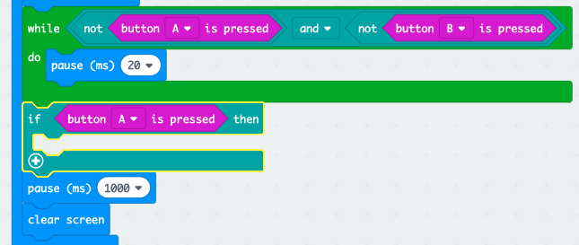
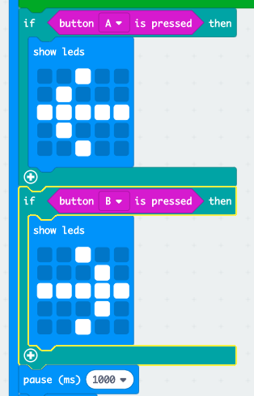

## Who is the fastest?

Let's find out who pressed their button first.

+ If button A was pressed, we want to point to player A. To do this, add an `if` block after your `while` loop, and replace `test` with `button A is pressed`.

+ You can then use the `show leds` block to show an arrow pointing to player A.

+ You should also do the same for button B.

