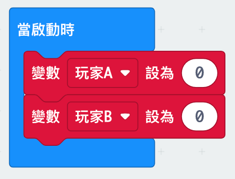

--- challenge ---

## Challenge: Keep score
Can you use two variables called `playerA` and `playerB` to keep track of each player's score?

You'll need to set both scores to 0 at the start of the game by placing code inside the 'on start' block.

And add 1 to whichever player wins each round.

You'll also need to think of a way to display the score. 

--- /challenge ---