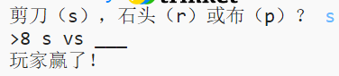

## 介紹

在這個專案中，你將建立一個剪刀、石頭、布的遊戲並與電腦對戰。

規則: 您和電腦同時選擇剪刀、石頭或布。 由以下規則決定獲勝者：

* 石頭砸壞剪刀
* 布包裹住石頭
* 剪刀剪壞布

  <iframe src="https://trinket.io/embed/python/3231ae8396?outputOnly=true&start=result" width="600" height="500" frameborder="0" marginwidth="0" marginheight="0" allowfullscreen>
  </iframe>
  

### 俱樂部負責人附加備註

如果您需要列印此專案，請使用[適合列印版本](https://projects.raspberrypi.org/zh-CN/projects/rock-paper-scissors/print) 。

--- collapse ---
---
title: 俱樂部負責人備註
---

## 介紹:

在這個專案中, 孩子們將學習如何使用變數和條件語句來製作剪刀、石頭、布的遊戲程式。

## 線上資源

**本專案使用Python 3。**我們建議使用[ trinket](https://trinket.io/)線上編寫Python程式碼。 本專案可在如下Trinket平臺中執行：

* [“剪刀、石頭、布”資源 -- jumpto.cc/rps-go](http://jumpto.cc/rps-go)

如下Trinket平臺展示了一個完整的專案：

* [已完成的'剪刀、石頭、布' - trinket.io/python/3231ae8396](https://trinket.io/python/3231ae8396)

## 離線資源

您也可以[離線完成](https://www.codeclubprojects.org/en-GB/resources/python-working-offline/)本專案。 您可以通過點選“專案資料”連結，訪問本專案的資源。 此連結中的“專案資源” 部分，包含孩子們完成該專案所需的離線資源。 請確保每個孩子都可以訪問這些資源。 這部分包含如下檔案：

* rock-paper-scissors/rock-paper-scissors.py

您也可以在 “志願者資源'”部分找到該專案的已完成版本，其中包含：

* rock-paper-scissors-finished/rock-paper-scissors.py

(上述所有資源均可下載為專案和志願者`.zip`檔案。)

## 學習目標

* 變數；
* 選擇語句（`if` ，` elif ` ，`else`）; 
* 布林邏輯 `==`和`and` 。

該專案涵蓋了[Raspberry Pi數字製作課程](http://rpf.io/curriculum)中的以下內容 ：

* [利用基本程式設計框架建立簡單程式。](https://www.raspberrypi.org/curriculum/programming/creator)

## 挑戰

* “ASCII藝術” - 通過條件邏輯顯示剪刀、石頭、布的ASCII藝術圖形。 
* "建立一個新遊戲" - 複製剪刀、石頭、布遊戲程式碼，在此基礎上建立一個新的遊戲。 

--- /collapse ---

--- collapse ---
---
title: 專案材料
---

## 專案資源

* [所有專案資源的.zip檔案](resources/rock-paper-scissors-project-resources.zip)
* [包含所有 ' 剪刀、石頭、布 ' 專案資源的線上Trinket平臺](http://jumpto.cc/rps-go)
* [rock-paper-scissors/rock-paper-scissors.py](resources/rock-paper-scissors-rock-paper-scissors.py)

## 俱樂部負責人資源

* [所有已完成專案資源的.zip檔案](resources/rock-paper-scissors-volunteer-resources.zip)
* [已完成的線上Trinket專案](https://trinket.io/python/3231ae8396)
* [rock-paper-scissors-finished/rock-paper-scissors.py](resources/rock-paper-scissors-finished-rock-paper-scissors.py)

--- /collapse ---