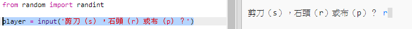
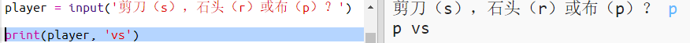

## 玩家回合

首先，讓玩家選擇剪刀、石頭或布。

+ 開啟此Trinket: <a href="http://jumpto.cc/rps-go" target="_blank"> jumpto.cc/rps-go </a>。

+ 此專案已包含用於匯入函式的程式碼，該函式將用於此專案的程式設計。
    
    
    
    之後你將使用`randint`生成隨機數。

+ 首先，讓玩家選擇鍵入字母's'，'r'或'p'，分別代表剪刀，石頭或布。
    
    

+ 接下來將顯示出玩家的選擇：
    
    

+ 點選`Run`按鈕測試你的程式碼 。 單擊Trinket的輸出視窗並輸入您的選擇。