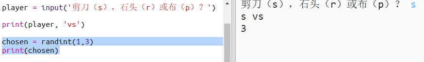
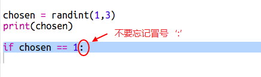
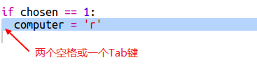
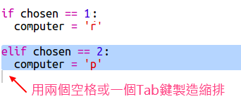
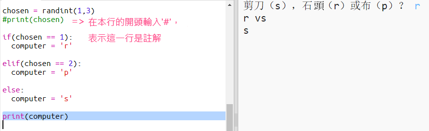
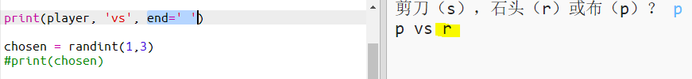

## 電腦回合

現在輪到電腦回合。 您可以使用`randint`函式來生成隨機數字，並用以選擇剪刀、石頭或布。

+ 使用`randint`生成一個隨機數字，用來決定電腦在剪刀、石頭或布中作出選擇。
    
    

+ 多次執行你的程式（在每次的執行中，您都需要輸入's'，'r'或'p'。）
    
    'chosen'應當是被隨機設定為1,2或3。

+ 讓我們設定：
    
    + 1 = 石頭（r）
    + 2 = 布（p）
    + 3 = 剪刀（s）
    
    使用`if`來判斷隨機生成的數字是否等於`1`（使用`==`來判斷兩個事物是否相同）。
    
    

+ Python使用**縮排**（將程式碼向右移動）來顯示哪些程式碼是在`if`語句之內的。 你可以用兩個空格符號（按空格鍵兩次）或按**tab鍵**（通常在大寫鎖定鍵的上方）來輸入縮排。
    
    在`if`語句內，將`computer`變數的值設為'r'。
    
    

+ 您還可以新增一個`elif`語句（*else if*的縮寫）來做進一步的判斷。
    
    
    
    只有當第一個條件語句判斷未通過的情況下（即當電腦沒有選擇`1`），這個條件語句才會被檢測。

+ 最後，如果電腦沒有選擇`1`或`2`，那麼它一定選擇了`3`。
    
    這裡我們可以用`else`來表示最後一個可能性。
    
    

+ 接下來，您可以輸入字母，而非電腦所選的隨機數字。
    
    
    
    你可以刪除`print(chosen)`這一行，或者在這一行開頭插入`#`來指示電腦忽略這一行。

+ 點選“Run”按鈕並輸入您的選項來測試程式碼。

+ 啊喔，電腦的選擇被顯示在新的一行上了。 為了解決這一問題，您可以在`vs`之後新增`end =''`，示意Python以空格結束，而不是另起一行。
    
    

+ 通過點選"Run"並做出選擇，多次進行此遊戲。
    
    現在你得靠自己去解決誰贏了的問題。 按下來您將新增Python程式碼來解決這個問題。